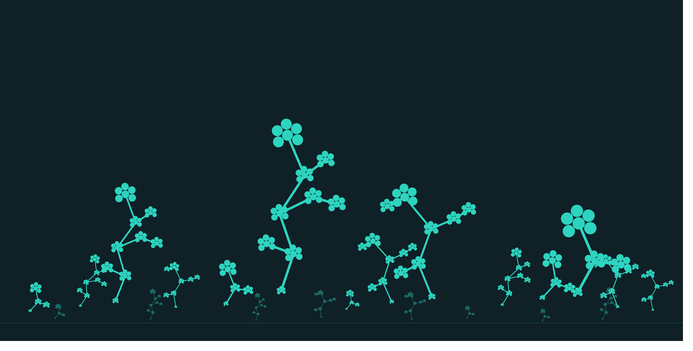

  

# ehcastroh-teach

**Teaching materials, notebooks, and reference repos for AI, Machine Learning, Applied Data Science and Data Engineering topics.**

---

## Getting started

1. Browse the repository list for the topic you're interested in.
2. Each repo's own README covers prerequisites, setup, and suggested order for working through the material.
3. Notebooks are designed to run top-to-bottom; start from a clean environment using the provided dependency file.

## Index of repositories

<table>
<tr><th align="left">Repository</th><th align="left">Topic</th><th align="left">Level</th><th align="left">Prerequisites</th></tr>
<tr><td><a href="https://github.com/ehcastroh-teach/Local_Llama">Local_Llama</a></td><td>Local LLM inference &amp; GPU-accelerated serving</td><td>Intermediate</td><td>Linux CLI</td></tr>
<tr><td><em>tbd</em></td><td>Foundations of machine learning</td><td>Beginner</td><td>None</td></tr>
<tr><td><em>tbd</em></td><td>Neural networks &amp; deep learning</td><td>Intermediate</td><td>ML foundations</td></tr>
<tr><td><em>tbd</em></td><td>Transformers &amp; attention</td><td>Intermediate</td><td>Neural networks</td></tr>
<tr><td><em>tbd</em></td><td>Applied data analysis &amp; visualization</td><td>Beginner</td><td>None</td></tr>
<tr><td><em>tbd</em></td><td>Practical AI tooling &amp; workflows</td><td>Intermediate</td><td>ML foundations</td></tr>
</table>

*This table is updated as repositories are migrated into the organization. Replace each `tbd` with the repo name and link once it's moved.*

## Featured: Local_Llama

**[Local_Llama](https://github.com/ehcastroh-teach/Local_Llama)** — running large language models on your own hardware, declaratively.

A start-to-finish guide for setting up GPU-accelerated [llama.cpp](https://github.com/ggml-org/llama.cpp) on NixOS, with every dependency declared in version-controlled config rather than installed ad hoc. Covers the full path from a bare driver check to a working OpenAI-compatible inference endpoint.

**What's inside**

- Step-by-step tutorial with an expected-output check after every step, so you can confirm progress instead of guessing
- Drop-in Nix modules for llama.cpp (CUDA), `huggingface-cli`, and an optional systemd service
- Guidance on choosing quantization levels against your available VRAM
- A troubleshooting table mapping real error messages to fixes
- The reasoning behind llama.cpp vs. Ollama vs. vLLM for single-GPU use

**Why it's worth reading even if you don't use NixOS:** the model-selection, quantization, VRAM-budgeting, and GPU-verification material transfers to any local inference setup. The declarative-config discipline is the part that's NixOS-specific.

**Prerequisites:** comfort with a Linux command line. An NVIDIA GPU is assumed for the CUDA path, though the modules note ROCm, Vulkan, and Metal alternatives.

## Repository conventions

To keep things predictable across repos in this org:

- **Naming** — repos follow `topic-short-name` (e.g. `neural-nets-intro`, `transformer-attention`).
- **Structure** — most repos include:
  - `notebooks/` — walkthroughs and exercises (Jupyter)
  - `data/` — sample or synthetic datasets used in the material
  - `solutions/` — worked solutions, kept separate from exercises
  - `README.md` — topic overview, prerequisites, and setup instructions
- **Environments** — Python-based repos include a `requirements.txt` or `environment.yml` for reproducibility.
- **Licensing** — teaching content is shared under an open license per-repo (see individual repo `LICENSE` files); check before reuse or redistribution.

Some repos are setup and infrastructure guides rather than notebook collections. These follow the same README conventions but ship reference config files in place of `notebooks/` and `data/` — `Local_Llama` is the current example.

## Contributing / feedback

These materials are actively maintained. If you spot an error or have a suggestion, open an issue on the relevant repository.

Questions about a specific repo belong on that repo's issue tracker. For anything about the organization itself — new topics, collaboration, or general feedback — reach out via LinkedIn or GitHub below.

---

## Contact

  

  ehcastroh

  <a href="https://github.com/ehcastroh">GitHub</a> · <a href="https://www.linkedin.com/in/ehcastroh/">LinkedIn</a>

