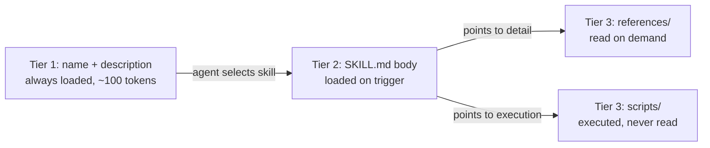

# Skills

Personal reference notes. Sources: [Claude Platform Docs - Agent Skills overview](https://platform.claude.com/docs/en/agents-and-tools/agent-skills/overview) and [best practices](https://platform.claude.com/docs/en/agents-and-tools/agent-skills/best-practices), plus the [agent skills open standard](https://agentskills.io) and the [Claude Code Skills reference](https://code.claude.com/docs/en/skills.md) for the Claude-Code-specific frontmatter fields in §3. Security figures: [Snyk's ToxicSkills audit, Feb 2026](https://snyk.io/blog/toxicskills-malicious-ai-agent-skills-clawhub/).

## 1. What a skill is

A **skill** teaches the model a procedure or convention for something it can already do - as opposed to a **tool**, which extends what it can do at all (see `02-tools.md`). A skill is a folder, not a prompt snippet: `SKILL.md` plus optional `references/`, `scripts/`, and `assets/`.

In Claude Code specifically, **custom slash commands and skills are the same mechanism**: a flat file at `.claude/commands/deploy.md` and a folder at `.claude/skills/deploy/SKILL.md` both create `/deploy` and behave identically at the invocation level. A skill folder is the superset - it adds a place for supporting files and the invocation-control frontmatter in §3. Reach for a flat command file only when there's genuinely nothing to bundle and no invocation control needed; otherwise a skill folder costs nothing extra and leaves room to grow.

```
skill-name/
├── SKILL.md                 # required: metadata + process, <500 lines
├── references/               # loaded only when SKILL.md points to it
├── scripts/                  # executed, source never enters context
└── assets/                   # used verbatim in output (templates, fonts)
```

## 2. Three-tier loading and progressive disclosure



Only `name` and `description` are loaded at startup for *every* installed skill. This is the highest-leverage text in the whole artifact - a perfect body never executes if the description never fires.

## 3. Frontmatter rules (the part that fails silently)

- `name`: 1–64 chars, lowercase letters/numbers/hyphens only, no leading/trailing/consecutive hyphens, **must exactly match the parent folder name** or the skill silently fails to load. Gerund form reads well (`processing-pdfs`, `reviewing-contracts`). Avoid `helper`/`utils`. No `anthropic`/`claude` in the name. No XML tags in either field.
- `description`: **third person**, states *what it does and when to use it* using real trigger vocabulary. First/second person phrasing ("I can help you...") measurably hurts discovery because the text gets injected into a system prompt verbatim. `description` plus `when_to_use` combined is truncated at 1,536 chars in the skill listing - put the key trigger phrase first. If omitted, `description` defaults to the first non-empty line of the body, which is rarely what you want.
- `when_to_use`: optional, appended to `description` - extra trigger phrases or example requests, useful when the natural-language description reads better without them crammed in.

Claude-Code-specific fields (beyond the open-standard core of `name`/`description`):

| Field | Purpose |
|:---|:---|
| `disable-model-invocation` | User-only - Claude never auto-triggers it, only explicit invocation. Use for heavyweight or side-effecting workflows where a false trigger is costly. |
| `user-invocable: false` | The inverse - Claude-only, hides the skill from the `/` menu. For background knowledge with no reason for a human to type it directly. |
| `allowed-tools` / `disallowed-tools` | Pre-approve or remove specific tools for the turn that invokes the skill; the grant/removal clears at the next user message. |
| `argument-hint` | Autocomplete hint shown to the user, e.g. `[issue-number]`. |
| `arguments` | Named positional args (space-separated string or YAML list) bound to `$name` in the body, instead of parsing `$ARGUMENTS` by hand. |
| `model` / `effort` | Override the session's model or effort level while the skill is active. |
| `context: fork` + `agent` + `background` | Run the skill in an isolated subagent instead of the current context; `agent` picks the subagent type, `background: false` waits for the result inline instead of running detached. |
| `paths` | Glob patterns that limit auto-activation to matching files being edited. |
| `shell` | `bash` (default) or `powershell`, for `` !`command` `` execution inside the body. |
| `hooks` | Hooks scoped to this skill's own lifecycle, auto-registered on invocation and cleaned up when it finishes - see `11-hooks.md` §6. |
| `license` / `compatibility` / `metadata` | Part of the open agent-skills standard; Claude Code accepts but doesn't act on them itself. |

Most of these exist to answer one question - **who can trigger this, and what does it need pre-approved when it does** - so when adding a field, check that question first rather than reaching for the table by habit.

## 4. Content rules

The point of a skill is knowledge the model can't reach on its own - content generated by asking a model to "write a skill for X" tends to be generic advice it already had.

- Source content from **doing the task by hand once** (record every correction made) or **mining existing artifacts** (runbooks, PR comments, incident notes).
- **Gotchas are the highest-value section** - any environment-specific fact that defies a reasonable default assumption.
- Delete anything the model would have produced unprompted; every paragraph should justify its token cost.
- One default with an escape hatch beats five options listed for the model to choose among.
- No date-conditional instructions - put superseded approaches in an "old patterns" section instead of writing around "as of [date]."
- Include input/output examples wherever style matters - they communicate the target more precisely than prose description.

## 5. Context economy

- Keep the `SKILL.md` body under ~500 lines (~5k tokens); split overflow into `references/`.
- Keep every reference **one level deep** from `SKILL.md`. Nested references get partially read - the agent previews with something like `head -100` and acts on incomplete information.
- Add a table of contents to any reference file over ~100 lines so a partial read still reveals full scope.
- Partition references by domain so an unrelated question loads nothing extra.

## 6. Determinism gradient - matching prescriptiveness to fragility

| Freedom | Use when | Form |
|:---|:---|:---|
| High | Many valid paths, context should decide | Prose steps |
| Medium | A preferred pattern, acceptable variation | Template or parameterized snippet |
| Low | Fragile, order-dependent, or destructive | Exact script invocation - "run exactly this," stated explicitly, never left to inference |

Script-writing rules: solve errors inside the script rather than deferring recovery to the agent; justify every timeout/retry constant in a comment; make validation errors verbose (list valid field names, not just "invalid"); use a **plan → validate → execute** pattern for batch or destructive work.

## 7. Evaluation-first development

The biggest process mistake is authoring content before testing for a gap. Correct order:

1. Run the task with **no skill** and record exactly where it fails.
2. Build 3+ evaluation scenarios directly from those failures, with a no-skill baseline.
3. Write the *minimum* content that closes the observed gap.
4. Test with a **fresh agent instance** (not the one that authored the skill) and observe navigation behavior - unexpected read order, missed references, or repeatedly re-read files all signal a structural problem, independent of output quality.
5. Re-run the full eval suite after *any* edit, including description-only edits - discovery changes affect the whole library, not just the edited skill.

## 8. Security: a skill is a dependency

A skill folder executes with the privileges of the agent running it - filesystem, shell, network, whatever credentials are in the environment. Published-ecosystem audits (Feb 2026, ~4,000 skills scanned) found roughly a third carrying at least one security flaw and about one in eight carrying a critical one, with most malicious skills combining prompt injection and conventional malware to defeat both defenses at once. **Skills bundling executable scripts were roughly twice as likely to contain vulnerabilities as instruction-only skills** - which cuts directly against Section 6: write your own scripts for determinism, and scrutinize anyone else's scripts twice as hard.

Minimum audit bar before running a third-party skill: read every file, inventory what it reaches (paths, domains, env vars), treat any skill that fetches instructions from an external URL as high risk, and don't rely on a registry scan badge as your control - public scanners have been shown to be bypassable. Watch for the combination of *private data access + untrusted content + an outbound channel* in one session - any two are survivable, all three is an exfiltration path.

## 9. Pre-ship checklist

- [ ] Description states what and when, third person, real trigger vocabulary
- [ ] `name` matches folder name exactly and follows the character rules
- [ ] Body under ~500 lines; references one level deep; long references have a TOC
- [ ] Nothing in the body the model already knew
- [ ] Fragile steps are scripts with explicit run-vs-read intent
- [ ] At least 3 evaluation scenarios, run against a no-skill baseline
- [ ] Tested with a fresh agent instance
- [ ] Third-party content read line by line, permissions scoped to minimum

---
*Part of a reference set: prompt engineering → tools → skills → context engineering → RAG → MCP → harness engineering → running LLMs locally → agent sandboxing → loop engineering → hooks → sandboxing → evals → agent orchestration → plugins (`19`). See also `00-skills-hooks-plugins-commands-quickref.md` for the condensed, field-by-field version of this file.*
