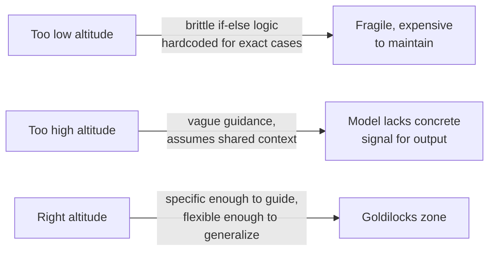
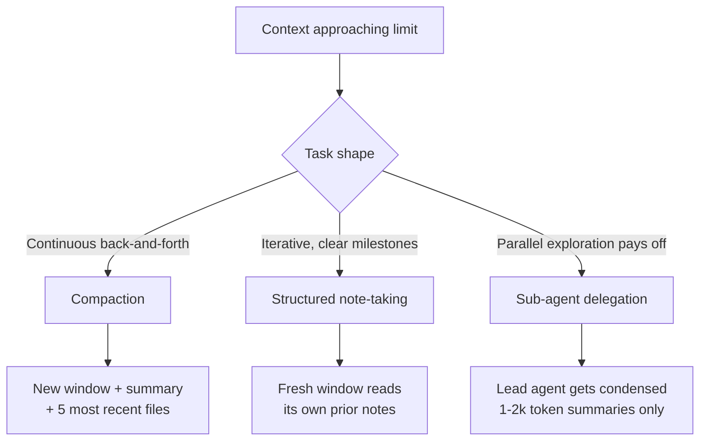

# Context Engineering

Personal reference notes. Primary source: [Anthropic - Effective context engineering for AI agents](https://www.anthropic.com/engineering/effective-context-engineering-for-ai-agents) (Sept 2025).

## 1. Definition and relationship to prompt engineering

**Context engineering** is the set of strategies for curating and maintaining the optimal set of tokens during inference - not just the prompt, but everything that lands in the model's window: system instructions, tool definitions, MCP connections, retrieved data, and message history. Anthropic frames it as prompt engineering's natural progression: prompt engineering asks *what do I write*; context engineering asks *what configuration of context is most likely to produce the desired behavior*, treated as a continuously curated state rather than a one-time draft.

The guiding principle, stated directly in the source and worth memorizing: **find the smallest possible set of high-signal tokens that maximizes the likelihood of the desired outcome.**

## 2. Why it matters: context rot and the attention budget

LLMs, like humans, lose precision as the amount of information in view grows. Needle-in-a-haystack research names this **context rot**: as token count in the context window increases, the model's ability to accurately recall specific information from it decreases - a gradient, not a cliff, but a real one across all models tested.

The architectural reason: transformers give every token pairwise attention to every other token - n² relationships for n tokens. As context grows, that budget stretches thinner, and models see comparatively less of their training data at very long sequence lengths (short sequences dominate typical training distributions), so they have fewer specialized parameters for context-wide dependencies at extreme lengths. Treat context as a **finite resource with diminishing marginal returns**, not a free bucket to fill.

## 3. Calibrating the system prompt: finding the right altitude

Two failure modes bracket the target:

Organize prompts into distinct labeled sections (`<background_information>`, `<instructions>`, `## Tool guidance`) using XML tags or Markdown headers consistently. Start with a **minimal** prompt tested against the strongest available model, then add instructions and examples based on observed failure modes - not preemptively. "Minimal" does not mean short; it means nothing present that isn't earning its place.

Tools and examples get the same discipline: tools should be self-contained, non-overlapping, and unambiguous about when to use them (if a human engineer can't say definitively which tool applies, the agent can't either); examples should be a small, diverse, canonical set rather than an exhaustive edge-case list - "pictures worth a thousand words," not documentation.

## 4. Context retrieval: pre-computed vs. just-in-time

Two strategies for getting external data into context, and the field is shifting weight toward the second without abandoning the first:

| Strategy | Mechanism | Trade-off |
|:---|:---|:---|
| Pre-computed (classic RAG) | Embedding-based retrieval before inference | Fast at query time; can go stale; misses context a live look would catch |
| Just-in-time | Agent keeps lightweight references (file paths, links, stored queries) and loads data via tools at runtime | Mirrors how humans use file systems and bookmarks; enables progressive disclosure; slower per-lookup than a precomputed hit |

Claude Code's own design is explicitly **hybrid**: `CLAUDE.md` files are dropped into context upfront (static, high-value, cheap), while `glob`/`grep`-style primitives handle live navigation - bypassing stale-index problems entirely for anything that changes often. The hybrid model is specifically recommended for less-dynamic domains like legal or finance work; more exploratory domains lean further toward just-in-time. Full mechanics of the retrieval side live in `05-rag.md`.

Just-in-time navigation also has a side benefit worth naming: it enables **progressive disclosure** - the agent discovers relevant context incrementally (file size implies complexity, naming conventions imply purpose, timestamps proxy for relevance), assembling understanding layer by layer instead of drowning in an exhaustively pre-loaded dump.

## 5. Long-horizon techniques (multi-window / multi-hour tasks)

For tasks whose total token count exceeds one context window - large migrations, multi-hour research - three techniques address context pollution directly:

| Technique | What it does | Best suited for |
|:---|:---|:---|
| **Compaction** | Summarize a near-full context window, reinitiate with the summary + most-recently-touched files | Tasks needing continuous conversational flow with heavy back-and-forth |
| **Structured note-taking** | Agent writes persistent notes (a `NOTES.md`, a to-do list) outside the window, re-reads them after a reset | Iterative work with clear milestones; near-zero overhead persistent memory |
| **Sub-agent architectures** | Specialized sub-agents explore extensively (tens of thousands of tokens) but return only a condensed summary (1,000–2,000 tokens) to the lead agent | Complex research/analysis where parallel exploration pays off; keeps detailed search context isolated from the coordinating agent |

Compaction quality depends entirely on what's discarded vs. kept - tune the compaction prompt on real complex traces, maximizing recall first (capture everything relevant), then iterating for precision (cut the superfluous). The single safest, lowest-risk form of compaction is clearing stale tool-call *results* while keeping the calls themselves visible - once a tool has run, the agent rarely needs the raw payload again.

## 6. Practical takeaway

As models improve, the trend is toward *less* prescriptive human curation and *more* autonomous context management - but "do the simplest thing that works" remains the standing default. Don't reach for compaction, sub-agents, or heavy retrieval infrastructure until a real failure mode (not a hypothetical one) demonstrates the need.

---
*Part of a 12-file reference set: prompt engineering → tools → skills → context engineering → RAG → MCP → harness engineering → running LLMs locally → agent sandboxing → loop engineering → hooks → sandboxing.*
