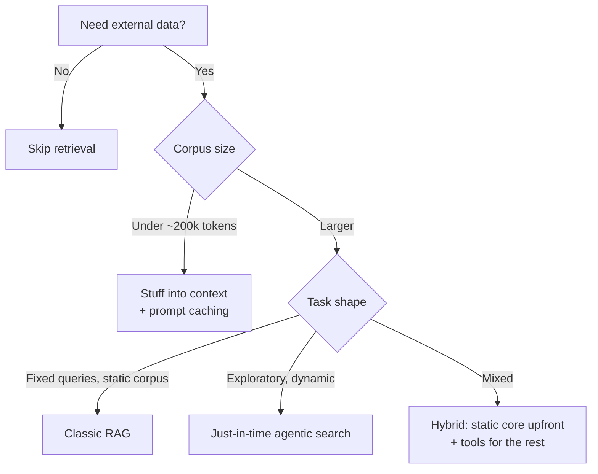
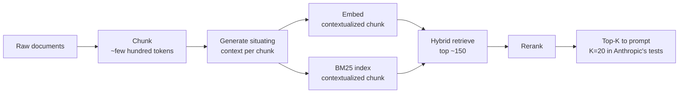

# RAG (Retrieval-Augmented Generation)

Personal reference notes. Sources: [Anthropic - Introducing Contextual Retrieval](https://www.anthropic.com/engineering/contextual-retrieval) (Sept 2024), [Anthropic - Effective context engineering for AI agents](https://www.anthropic.com/engineering/effective-context-engineering-for-ai-agents), [Google - Introducing the File Search Tool in the Gemini API](https://blog.google/innovation-and-ai/technology/developers-tools/file-search-gemini-api/).

## 1. RAG is one retrieval strategy, not the whole category

"Give the model outside data" splits into three genuinely different approaches. Conflating them is the most common design mistake:

| Strategy | Mechanism | When it fits |
|:---|:---|:---|
| Long-context stuffing | Whole corpus in the prompt | Corpus under ~200k tokens (~500 pages); prompt caching makes repeat use fast and cheap - no RAG infrastructure needed at all |
| Classic RAG | Precomputed chunks + embeddings, retrieved once per query | Large, mostly-static corpus with fixed-shape queries |
| Just-in-time / agentic search | Agent uses tools to explore and pull data live, keeping only lightweight references | Large, exploratory corpus; mirrors how humans use file systems and bookmarks rather than memorizing everything |

The industry term for tool-mediated, multi-step retrieval is **agentic RAG** - a control loop of retrieve → reason → decide → retrieve again, rather than one retrieve-then-generate pass. Flag: this is popular vendor/blog terminology, not a standardized spec concept - treat definitions as directional, unlike the MCP primitives in `06-mcp.md`, which are normative.

## 2. Classic RAG pipeline

1. **Chunk** the corpus - typically a few hundred tokens per chunk.
2. **Embed** each chunk into a vector; separately build a **BM25** lexical index (exact term matching - critical for queries containing specific identifiers like error codes, which embeddings alone can miss).
3. At query time, **hybrid retrieve**: run both embedding similarity and BM25, then merge/deduplicate with rank fusion.
4. **Rerank** the merged candidates down to a final top-K.
5. Add the top-K chunks to the prompt.

**Why hybrid over embeddings alone:** a query for "error code TS-999" needs the literal string match BM25 provides - semantic search alone might retrieve generally-related content while missing the exact identifier.

## 3. Contextual Retrieval (Anthropic's technique)

The core problem with naive chunking: a chunk like *"the company's revenue grew by 3% over the previous quarter"* is useless in isolation - no company, no quarter. **Contextual Retrieval** fixes this by prepending a short (50–100 token) situating context to each chunk - generated by an LLM summarizing the chunk's role in its source document - before both embedding *and* BM25 indexing.

**Reported results** (single-team benchmark, Sept 2024 - not independently replicated; treat as directional and test on your own domain before trusting the numbers):

| Configuration | Retrieval failure rate | Reduction vs. baseline |
|:---|:---|:---|
| Embeddings only (baseline) | 5.7% | - |
| + Contextual Embeddings | 3.7% | 35% |
| + Contextual BM25 (hybrid) | 2.9% | 49% |
| + Reranking | 1.9% | 67% |

Implementation notes:

- **Prompt caching makes this cheap.** The reference document loads into cache once rather than being re-sent per chunk - brings the one-time contextualization cost to roughly $1.02 per million document tokens.
- Chunk boundary, size, and overlap choices all affect performance - no universal default.
- Embedding model matters: Gemini and Voyage embeddings tested particularly well in Anthropic's evaluation.
- More chunks in context isn't free - 20 chunks outperformed 5 or 10 in testing, but more information is also more distracting, so this has a ceiling worth finding empirically per use case.
- **Always run evals** - response generation quality benefits from explicitly distinguishing "this is context" from "this is the chunk" in the prompt structure.

## 4. Build vs. buy: managed RAG (Gemini File Search)

Google's **File Search tool** is the fully-managed alternative worth knowing before building a pipeline from scratch: upload documents, and the API handles chunking, embedding, indexing, and citation-linked retrieval automatically within the standard `generateContent` call.

- **Citations are built in** - every grounded response links back to the specific document/page (and, for multimodal stores, the specific image chunk via a persistent `media_id`).
- **Trade-off**: you give up chunking strategy, embedding model choice, and ranking control in exchange for zero infrastructure. Custom chunking and metadata filtering are available but limited compared to a hand-rolled pipeline.
- Storage and query-time embeddings are free in Google's pricing model; you pay only for initial indexing and standard model I/O tokens.

Rule of thumb: prototype on managed RAG to validate the use case fast; move to a custom Contextual Retrieval pipeline when you need chunking/ranking control the managed tool doesn't expose, or when cost at scale favors self-hosting.

## 5. Relationship to context engineering and skills

RAG is one *implementation* of a more general principle covered in `04-context-engineering.md`: load only the smallest set of high-signal tokens needed. A skill's `references/` folder (progressive disclosure), an MCP resource (see `06-mcp.md`), and a classic RAG index are four different mechanisms for the same underlying idea, differing only in where the data lives and how the agent finds it.

---
*Part of a 12-file reference set: prompt engineering → tools → skills → context engineering → RAG → MCP → harness engineering → running LLMs locally → agent sandboxing → loop engineering → hooks → sandboxing.*
