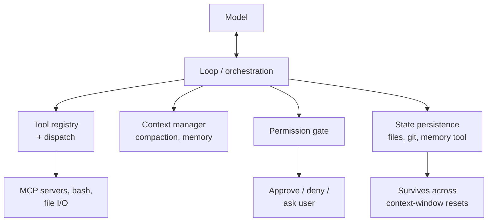
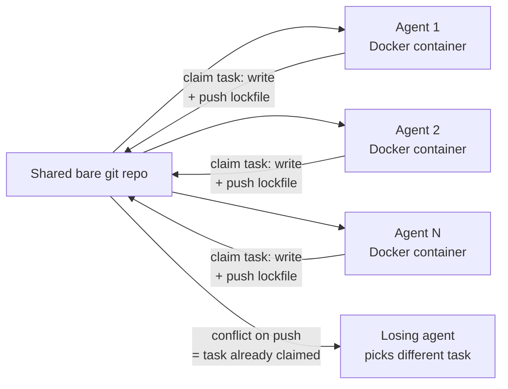

# Harness Engineering

Personal reference notes. Sources: [Anthropic - Effective harnesses for long-running agents](https://www.anthropic.com/engineering/effective-harnesses-for-long-running-agents), [Anthropic - Agent Harness Design: 3 Patterns for Harnessing Claude's Intelligence](https://claude.com/blog/harnessing-claudes-intelligence), [Anthropic - Building a C compiler with a team of parallel Claudes](https://www.anthropic.com/engineering/building-c-compiler), [Anthropic - How we built Claude Code auto mode](https://www.anthropic.com/engineering/claude-code-auto-mode).

## 1. Definition: agent = model + harness

An **agent harness** is the software scaffolding around a model: the loop, the tool registry, context management, and guardrails that turn raw model intelligence into a working agent. **Harness engineering** is the practice of deciding what belongs in that scaffolding - and, as the underlying model improves, what to remove. The concise framing worth keeping: *if you're not the model, you're the harness.* When someone says "I built an agent," in practice they built a harness and pointed it at a model.

This is the outermost of the three concentric layers from `01-prompt-engineering.md` and `04-context-engineering.md`:

| Layer | Question | Analogy |
|:---|:---|:---|
| Prompt engineering | What do I say this turn? | Writing one instruction |
| Context engineering | What surrounds the prompt, and how is it curated? | Managing working memory |
| **Harness engineering** | What system runs the loop, calls tools, persists state, and enforces boundaries? | The operating system the model runs on |

A useful mental model (Beren Millidge's framing, widely cited in harness-engineering writing): a raw LLM is like a CPU with no RAM, no disk, and no I/O. The context window is RAM - fast, limited. External storage (files, databases) is disk - large, slow. Tool integrations are device drivers. **The harness is the operating system** wrapping all of it.

## 2. Anthropic's three design patterns

From Anthropic's April 2026 harness-design guidance - the core insight is that every harness component encodes an assumption about what the model *can't* do on its own, and those assumptions go stale as the model improves:

1. **Build on what the model already knows.** Don't scaffold around a limitation the model has already outgrown - check current capability before adding compensating structure.
2. **Ask what you can stop doing.** Periodically prune harness components built to compensate for a past weakness. Anthropic's own example: context resets built to compensate for a model's poor self-assessment became dead weight once the model's self-assessment improved, and the extra structure actively bottlenecked performance rather than helping it.
3. **Set UX/cost/safety boundaries deliberately.** The parts of a harness that *shouldn't* shrink as the model improves - permission boundaries, spend limits, irreversible-action gates - are policy decisions, not compensations for model weakness, and should be maintained independently of model capability.

The practical discipline this implies: **treat every piece of your harness as having an expiration condition**, and revisit it periodically rather than treating scaffolding as a one-time build.

## 3. Anatomy of a harness

Every harness assembles roughly these components, whether hand-rolled or productized (Claude Code, the Claude Agent SDK):

The model reasons; the harness acts. When the model "reads a file," the harness decides whether the read is permitted, what happens to the raw result before it re-enters context, and how the response gets shaped to fit the next prompt. The model never touches the filesystem, network, or shell directly - every action is mediated.

## 4. Long-running agents: the initializer / coding-agent split

**The core problem**: agents work in discrete context-window sessions with no memory between them - like a project staffed by engineers on rotating shifts, each arriving with zero knowledge of the previous shift's work. Compaction alone is not sufficient: even a frontier model, given only a high-level prompt and looped across many windows, tends to either try to one-shot the entire task (running out of context mid-implementation, leaving the next session to guess at half-finished work) or falsely declare victory once *some* progress is visible.

Anthropic's two-fold solution:

1. **Initializer agent** (first session only): sets up a durable environment - an `init.sh` script that starts the dev server, a structured **feature list** (JSON, not Markdown - models are less likely to inappropriately overwrite JSON) enumerating every requirement as an initially-`failing` test, and an initial git commit.
2. **Coding agent** (every subsequent session): reads the existing state, works on exactly **one feature at a time**, self-verifies end-to-end (not just unit tests - Anthropic found models will unit-test a feature and still miss that it's broken end-to-end unless explicitly told to test as a human user would, e.g. via browser automation), and leaves the environment in a clean, mergeable state before exiting: a git commit with a descriptive message, and a progress-notes update.

| Failure mode | Initializer agent's fix | Coding agent's fix |
|:---|:---|:---|
| Declares the whole project done too early | Writes a structured feature-list file up front | Reads the feature list; works one item at a time |
| Leaves bugs or undocumented progress | Creates initial git repo + progress-notes file | Reads progress notes + git log at session start; commits + updates notes at session end |
| Marks features "done" prematurely | (same feature-list file) | Self-verifies end-to-end before marking `passes: true`; never edits/removes tests to make them pass |
| Wastes time figuring out how to run the app | Writes `init.sh` | Reads and runs `init.sh` at session start |

A typical session-start sequence, verbatim from Anthropic's own trace: run `pwd` (confirm working directory and scope), read the progress file and feature list, check `git log`, run `init.sh`, run a basic end-to-end smoke test *before* touching new work - because if the app is already broken, starting a new feature only compounds the problem.

## 5. Multi-instance / multi-agent harnesses

This is the pattern most directly relevant to a tmux-based multi-instance supervisor like herdr - running several agent instances concurrently is a harness-level decision with its own coordination problem.

**Two documented architectures:**

**Planner / generator / evaluator** - a lead agent decomposes a task; specialist agents generate candidate work; a *separate* evaluator agent grades it against explicit criteria (e.g., for frontend design work: design quality, originality, craft, functionality) using its own tools (browser automation to actually navigate the live output). The key finding behind separating generator from evaluator: agents systematically **overrate their own output**, especially on subjective tasks - a distinct evaluator, calibrated with few-shot examples and explicit scoring criteria, is a strong lever against that bias. Iterative cycles (5–15 rounds observed) of generate → evaluate → refine produce progressively better output than a single generate pass.

**Parallel workers on shared state, coordinated through git** - Anthropic's own experiment ran 16 parallel Claude instances (one per Docker container) against a single **shared bare git repo**, with no central orchestrator and no message broker:

- Each agent clones the shared repo locally, works, and pushes back to the shared upstream when done.
- **Task coordination is a lock file**, not a queue: an agent claims a task by writing a file (e.g. `current_tasks/parse_if_statement.txt`) and pushing. If two agents race for the same task, git's own conflict resolution rejects the second push - the loser picks a different task. No custom scheduler needed; git's atomic-commit and conflict-detection guarantees are inherited for free.
- Shared state across all agents lives in one plain progress file (e.g. `PROGRESS.md`) that every agent reads before starting a session - the same "structured note-taking" pattern from `04-context-engineering.md`, just shared across instances instead of within one.
- Running multiple instances addresses two distinct weaknesses of a single-agent harness: **serialization** (one session does one thing at a time - parallel debugging of independent issues is strictly faster) and **specialization** (dedicated agents can be tasked with documentation upkeep, code-quality review, or narrow sub-problems while others solve the main task).
- The load-bearing constraint the author names directly: since agents work autonomously without a human checking each step, **the task verifier must be near-perfect** - an agent will confidently solve the wrong problem if the thing telling it "you're done" is wrong.

Mapped onto your stack: herdr's role is the *supervision and visibility* layer over this pattern - running and observing several concurrent sessions - while the coordination substrate underneath (git worktrees or a shared bare repo, plus lock files or an equivalent claim mechanism) is what actually prevents two instances from colliding on the same work. herdr replaces the "16 Docker containers" plumbing in Anthropic's experiment; it does not replace the need for *some* claim mechanism if instances share a working tree. Anthropic's own productized version of this pattern ships as an "agent teams" feature in Claude Code - a shared task list plus peer-to-peer messaging between instances - worth checking against herdr's current capabilities before building custom coordination from scratch.

**Isolation vs. coordination - don't conflate them.** Git worktrees (or separate clones) prevent instances from overwriting each other's *files*. They do nothing to make instances agree on *architecture* or avoid duplicated work. Isolation is necessary but not sufficient; you still need an explicit coordination mechanism (shared task list, lock files, or a human assigning boundaries) on top of it.

## 6. Permissions and safety as a harness concern

The permission system is squarely a harness responsibility, not a prompt-engineering one - and it's a real design problem, not a solved one. Anthropic's own data: users approve roughly 93% of permission prompts, which means per-action approval habituates into a rubber stamp rather than functioning as real oversight. The response wasn't more warnings - it was restructuring the problem into **bounded autonomy**: define a boundary within which the agent acts freely (auto mode), backed by a fast classifier that still flags genuinely risky actions for a real approval gate, rather than prompting on every single tool call.

How the auto-mode classifier works, mechanically: a fast single-token gate runs on every action first; only flagged actions escalate to slower chain-of-thought reasoning. Command chains joined with `&&` are evaluated as one action; a script that assembles and then runs a shell command gets evaluated against the *assembled* command, not the literal script text. The classifier is deliberately conservative about inferring authorization - "clean up my branches" does not, by itself, authorize a batch delete, and "can we fix this?" is treated as a question, not a standing instruction. A prompt-injection probe separately screens *tool results* before they reach the agent, structurally isolated from the action-gating classifier so a compromised tool result can't talk its way past the permission check.

**Four-layer shared responsibility model** worth using as a checklist for any harness you build or adopt:

| Layer | Owner | What can go wrong here |
|:---|:---|:---|
| Model | Model provider | You don't control this - you chose a vendor and trust their safety training |
| Harness | You (or the harness vendor) | Stale permission defaults, an outdated system prompt, safety flags nobody's reviewing |
| Tools | You | MCP server connections and plugin capabilities changing without your team noticing |
| Environment | You | The sandbox, container, or machine the agent actually executes inside |

Practical rule pulled from Anthropic's own documentation: a full-bypass mode (`--dangerously-skip-permissions` in Claude Code, or equivalent) is intended **only for isolated containers or VMs**, never a production machine with real credentials in the environment - it provides no protection against prompt injection or unintended action, it just removes the check entirely.

## 7. Testing and self-verification inside a harness

The failure mode Anthropic observed repeatedly: a model does real work, even runs some tests, but doesn't recognize that a feature is broken end-to-end unless explicitly told to verify as a human user would. Giving the model actual verification tools - browser automation (Playwright/Puppeteer MCP), not just unit tests or `curl` - measurably improved bug-catching, because some classes of bug (a broken interactive flow, a UI element that renders wrong) are invisible from source code alone. This is a harness-provisioning decision, not something prompt wording alone can fix: the tool has to exist in the harness before "test it like a user would" has any teeth.

## 8. Checklist for reviewing or building a harness

- [ ] Every scaffolding component has a stated *reason* - which model limitation is it compensating for? Is that limitation still current?
- [ ] Long-running tasks have a durable state artifact (progress file + git, or equivalent) that survives a context reset
- [ ] Multi-instance setups have an explicit **coordination** mechanism, not just isolation - isolation alone lets instances duplicate work silently
- [ ] The task verifier (tests, feature-list, evaluator agent) is trustworthy enough to run unsupervised against - a weak verifier is worse than no automation, because it approves wrong work confidently
- [ ] Permission boundaries are a deliberate policy choice, reviewed independently of model capability - not something you're relying on the model to self-police
- [ ] Full-bypass / no-permission modes are scoped to isolated, disposable environments only
- [ ] Verification tools that matter for the task actually exist in the harness (browser automation, not just unit tests, for anything user-facing)

---
*Part of a 12-file reference set: prompt engineering → tools → skills → context engineering → RAG → MCP → harness engineering → running LLMs locally → agent sandboxing → loop engineering → hooks → sandboxing.*
