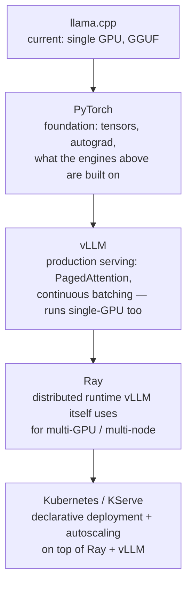

# Running LLMs Locally

Personal reference notes, written against your stack: NixOS + flakes, RTX 4070 (12 GB VRAM), 16 GB system RAM, llama.cpp + CUDA, Qwen2.5-Coder-7B-Q4_K_M, Ollama disabled, custom MCP server planned, herdr for concurrent agent sessions. Sources: [NixOS Wiki — Llama-cpp](https://wiki.nixos.org/wiki/Llama-cpp), [NixOS Wiki — CUDA](https://wiki.nixos.org/wiki/CUDA), [llama.cpp function-calling docs](https://github.com/ggml-org/llama.cpp/blob/master/docs/function-calling.md), [vLLM docs — Distributed Inference and Serving](https://docs.vllm.ai/en/latest/serving/parallelism_scaling/), [Ray Serve LLM docs](https://docs.ray.io/en/latest/serve/llm/index.html), [KServe docs](https://kserve.github.io/website/).

## 1. Where this file sits

This is the substrate the other seven files run on top of — the actual process serving tokens, on actual silicon, under an actual OS. It's also the most hardware- and environment-specific file in the set: numbers here are calibrated to a 12 GB card and 16 GB of system RAM, not general advice.

| Layer | File |
|:---|:---|
| What you say to the model | `01-prompt-engineering.md` |
| What surrounds the prompt | `04-context-engineering.md` |
| What scaffolding runs the loop | `07-harness-engineering.md` |
| **What actually executes the model** | **this file** |

## 2. VRAM math for your card

Qwen2.5-Coder-7B is a 7.6B-parameter dense model. Numbers below are for the community-standard `bartowski`/`Qwen` GGUF quantizations:

| Quant | Weight size (VRAM) | Notes |
|:---|:---|:---|
| Q4_K_M (current) | ~5.0 GB | Best quality-per-GB balance for this model size |
| Q5_K_M | ~5.4 GB | Marginal quality gain, worth it if VRAM allows |
| Q8_0 | ~8.0 GB | Near-lossless; still fits your 12 GB with room for context |
| Q4_K_L | ~5.1 GB | Q4_K_M with embeddings/output layers kept at Q8_0 — try this before jumping a full quant level |

**KV cache is the part people forget to budget.** At Qwen2.5-Coder-7B's native context, the full 32K-33K window can add up to ~1.8 GB at F16 KV cache, bringing total VRAM to roughly 6.8 GB at Q4_K_M. That leaves **~5 GB of headroom on your 12 GB card** — real capacity, not slack to ignore. Use it for one of:

- A longer context window (32K → higher, budget permitting)
- More `--parallel` slots so multiple herdr-supervised agents can share one server (Section 5)
- KV cache at higher precision (skip quantizing it at all — you likely don't need to)

**Why 16 GB system RAM still matters even though the model lives in VRAM:** llama.cpp memory-maps the GGUF file by default (`mmap`), and the OS page cache for that file competes with everything else running — herdr's tmux sessions, Neovim, WezTerm, Claude Code. 16 GB is comfortable for a 5 GB model file plus normal desktop load, but watch for pressure if you load multiple large GGUFs during experimentation (e.g., testing a 14B alongside the 7B) — `free -h` before assuming a slowdown is GPU-side when it might be page-cache thrashing.

## 3. Declarative packaging: `/etc/nixos/flake.nix`

llama.cpp's CUDA build is not enabled by default in nixpkgs — it requires an explicit override, `allowUnfree` (the CUDA toolkit is NVIDIA's, not open source), and a pinned nixpkgs input so the build doesn't silently drift.

```nix
# /etc/nixos/flake.nix
{
  description = "System flake: NixOS + CUDA-enabled llama.cpp";

  inputs = {
    # Pinned to a release channel, not "nixos-unstable" unqualified —
    # re-pin deliberately with `nix flake update` when you want to move.
    nixpkgs.url = "github:NixOS/nixpkgs/nixos-25.11";
  };

  outputs = { self, nixpkgs, ... }:
    let
      system = "x86_64-linux";
      pkgs = import nixpkgs {
        inherit system;
        config = {
          allowUnfree = true;   # required: CUDA toolkit is proprietary
          cudaSupport = true;   # builds CUDA-enabled variants where the package supports it
        };
      };
    in {
      nixosConfigurations.your-hostname = nixpkgs.lib.nixosSystem {
        inherit system;
        specialArgs = { inherit pkgs; };
        modules = [ ./configuration.nix ];
      };
    };
}
```

## 4. GPU driver and CUDA cache: inside `/etc/nixos/configuration.nix`

Two separate concerns live here: getting the NVIDIA kernel module loaded (`hardware.nvidia`), and telling Nix to trust the pre-built CUDA binary cache so you're not compiling CUDA-linked packages from source on every update.

```nix
# /etc/nixos/configuration.nix

{
  # --- GPU driver: enables the kernel module and OpenGL/Vulkan/CUDA userspace libs ---
  hardware.graphics.enable = true;          # required for any CUDA/GL workload, not just X11
  hardware.nvidia = {
    modesetting.enable = true;              # required for Wayland compositors; harmless otherwise
    package = config.boot.kernelPackages.nvidiaPackages.stable;  # pin the driver track explicitly
    open = false;                           # RTX 4070 (Ada Lovelace) supports the open kernel module;
                                             # set true if you want it, but `stable` (proprietary) is the
                                             # safer default for CUDA compute workloads today
  };
  services.xserver.videoDrivers = [ "nvidia" ];  # tells NixOS to actually load the driver above

  # --- nixpkgs-wide CUDA flags (must match what flake.nix sets for consistency) ---
  nixpkgs.config = {
    allowUnfree = true;
    cudaSupport = true;
  };

  # --- Trust the community CUDA binary cache so cudaSupport=true doesn't rebuild from source ---
  nix.settings = {
    substituters = [ "https://cache.nixos-cuda.org" ];       # cache moved here from cachix Nov 2025
    trusted-public-keys = [
      "cache.nixos-cuda.org:74DUi4Ye579gUqzH4ziL9IyiJBlDpMRn9MBN8oNan9M="
    ];
  };
}
```

## 5. Running llama-server as a persistent, shared service

**The concurrency mistake to avoid**: don't launch a separate `llama-server` process per herdr-supervised agent instance. Each process reloads the full model into VRAM independently — two instances of a 5 GB model is 10 GB gone before either does useful work, and you'd blow past 12 GB with a third. Run **one** server; give it enough parallel slots for every concurrent agent to share.

Declare it as a system service rather than a command you remember to run:

```nix
# /etc/nixos/configuration.nix, in the systemd.services block

systemd.services.llama-server = {
  description = "Shared llama.cpp inference server (Qwen2.5-Coder-7B)";
  wantedBy = [ "multi-user.target" ];
  after = [ "network.target" ];
  serviceConfig = {
    # llama-cpp built with cudaSupport = true from the overlay in flake.nix
    ExecStart = ''
      ${pkgs.llama-cpp.override { cudaSupport = true; }}/bin/llama-server \
        -m /var/lib/llama-models/qwen2.5-coder-7b-instruct-q4_k_m.gguf \
        -ngl 99 \
        -c 24576 \
        --parallel 3 \
        --cont-batching \
        -fa on \
        --jinja \
        --host 127.0.0.1 \
        --port 8080
    '';
    Restart = "on-failure";
    DynamicUser = true;               # runs as an unprivileged, auto-created system user
    SupplementaryGroups = [ "video" ]; # grants GPU device access without running as root
  };
};
```

Flag-by-flag, tied to your card:

| Flag | What it does | Why this value |
|:---|:---|:---|
| `-ngl 99` | Number of model layers offloaded to GPU | 99 exceeds the model's actual layer count, which is the standard idiom for "offload everything" |
| `-c 24576` | **Total** KV-cache token budget across *all* parallel slots, not per-slot | 3 slots × 8K context each — sized to fit inside the ~5 GB headroom from Section 2; raise this only after checking `nvidia-smi` under load |
| `--parallel 3` | Number of concurrent request slots the server will serve | Matches "a few herdr-supervised agents at once" — raise to match your actual concurrency, not higher |
| `--cont-batching` | Continuous (iteration-level) batching — new requests join a running batch instead of waiting for it to finish | Keeps the GPU busy when your agents' requests don't line up perfectly in time |
| `-fa on` | Flash Attention kernel | Faster prefill on long prompts; also the **hard prerequisite** for KV cache quantization below |
| `--jinja` | Use the model's embedded chat template (Jinja) instead of a hardcoded one | Required for Qwen2.5-Coder's native tool-calling format to work correctly |

**If you need more headroom later**, KV cache quantization (`-ctk q8_0 -ctv q8_0`) roughly halves KV memory with negligible quality loss — but it *requires* `-fa on` already being set, and value quantization is more sensitive than key quantization, so if you see degraded output, try `-ctk q8_0 -ctv f16` (quantize keys only) before reverting entirely.

## 6. Tool calling and the planned MCP server

This is where "Hermes" in your next-session agent stack connects directly to your local model: **Hermes-style tool calling** is a specific prompt/parser format — originally from NousResearch's Hermes models, now adopted broadly — for how a model emits tool calls as structured text the harness can parse. Qwen2.5-Coder's chat template natively speaks this format. Concretely: `llama-server --jinja` (already in Section 5's service) is what makes Qwen2.5-Coder-7B usable as a tool-calling backend at all; without `--jinja`, tool-call output won't parse reliably.

For the **custom MCP server** you're planning: llama.cpp's server already exposes an OpenAI-compatible `/v1/chat/completions` endpoint (`http://127.0.0.1:8080/v1` given the config above). The MCP server's job is *not* to reimplement inference — it's a thin layer that:

1. Exposes MCP tools (per `06-mcp.md`'s primitive definitions) to whatever harness connects — Claude Code, and next session, OpenCode.
2. Internally calls your local llama-server's OpenAI-compatible endpoint when a tool needs local inference (e.g., a fast/cheap local pre-filter before escalating to a cloud model).
3. Optionally routes: cheap/fast tasks to local Qwen, complex tasks to Claude or OpenAI per your planned OpenCode + Hermes routing — this is a natural place to implement a **model router** as an MCP tool rather than hardcoding the choice in the harness.

See `02-tools.md` for interface design and `06-mcp.md` for the primitive/security details — this file's scope stops at "the local endpoint the MCP server will call."

## 7. The curriculum ladder: llama.cpp → PyTorch → vLLM → Ray → Kubernetes

Be honest about what a single 12 GB card teaches you directly versus what you'll need to simulate or learn conceptually:



| Stage | What it adds over the previous | Real on your 4070? |
|:---|:---|:---|
| **llama.cpp** | GGUF quantization, CPU/GPU hybrid offload, minimal dependencies | Yes — this is your daily driver today |
| **PyTorch** | The tensor/autograd substrate every engine below is written in; understanding it demystifies what vLLM's kernels are actually doing | Yes, fully — training-adjacent work, custom kernels, fine-tuning experiments |
| **vLLM** | PagedAttention (near-zero KV cache waste via OS-style paging) + continuous batching, aimed at 10-500+ *concurrent* requests | Partially. Single-GPU vLLM runs fine on 12 GB with a 7B model at an appropriate quantization — see Section 8. Its throughput advantage over llama.cpp is real but shows up under **concurrent multi-user load**, which a single card serving one person doesn't stress much. |
| **Ray** | Distributed execution — vLLM uses Ray as its runtime for multi-node tensor/pipeline parallelism; Ray Serve LLM adds production routing, autoscaling, fault tolerance on top | Conceptually yes, meaningfully no — Ray's value is coordinating multiple GPUs/nodes. On one card you can install it and read the scheduler logic, but you won't see the throughput story it's built for. |
| **Kubernetes / KServe** | Declarative `InferenceService`/`LLMInferenceService` CRDs — autoscaling, GPU scheduling, canary rollouts, scale-to-zero — wrapping the Ray+vLLM stack | Same caveat as Ray, one level up. `kind` or `minikube` locally lets you exercise the YAML and CRD mechanics against a fake or CPU-only workload; the GPU-scheduling and autoscaling behavior needs either a multi-GPU box or a cloud burst to actually observe under load. |

**Practical path**: learn vLLM's serving model on your 4070 directly (Section 8) — that part transfers completely. Learn Ray and Kubernetes as *architecture and API surface* against a local `kind` cluster or a short cloud rental when you want to see real scaling behavior, rather than treating "no multi-GPU box" as a blocker to starting.

## 8. vLLM on a single 12 GB card

vLLM defaults toward less aggressive quantization than GGUF — expect to reach for AWQ, GPTQ, or FP8 checkpoints (not the same files as your GGUF quants) to fit comparably in 12 GB:

```bash
# Requires a quantized checkpoint built for vLLM (AWQ shown) — not your existing GGUF file
vllm serve Qwen/Qwen2.5-Coder-7B-Instruct-AWQ \
  --quantization awq \
  --max-model-len 8192 \
  --gpu-memory-utilization 0.90 \
  --enable-auto-tool-choice \
  --tool-call-parser hermes    # same Hermes format as Section 6 — Qwen's template already supports it
```

`--gpu-memory-utilization 0.90` tells vLLM to claim 90% of the card's VRAM upfront for its PagedAttention block pool — this is expected behavior, not a leak; it pre-reserves for peak concurrent load rather than growing dynamically like llama.cpp does.

For **one interactive user**, llama.cpp and vLLM will feel similar in raw token/sec — vLLM's architecture is optimized for many simultaneous requests competing for the same GPU, which single-user local use doesn't exercise. The honest reason to run vLLM locally right now is to *learn the serving model* (PagedAttention, continuous batching, the OpenAI-compatible server shape) ahead of the Ray/Kubernetes stages, not because it will feel faster than llama.cpp for your current single-agent workload.

## 9. Checklist

- [ ] `flake.nix` inputs pinned to an explicit release, not floating `nixos-unstable`
- [ ] `allowUnfree` and `cudaSupport` set consistently in both `flake.nix` and `configuration.nix`
- [ ] CUDA binary cache substituter configured — confirm you're not compiling CUDA packages from source
- [ ] `llama-server` runs as a single persistent systemd service, not one process per agent instance
- [ ] `--parallel` slot count matches actual expected concurrent herdr sessions, not guessed high
- [ ] `-c` (context budget) sized against Section 2's VRAM headroom, verified with `nvidia-smi` under real load
- [ ] `--jinja` enabled if any agent (current MCP plan, or next-session OpenCode+Hermes) needs tool calling against the local model
- [ ] Curriculum expectations calibrated: vLLM learnable fully locally; Ray/Kubernetes learnable architecturally locally, but need multi-GPU or cloud to observe their actual scaling payoff

---
*Part of a 12-file reference set: prompt engineering → tools → skills → context engineering → RAG → MCP → harness engineering → running LLMs locally → agent sandboxing → loop engineering → hooks → sandboxing.*
