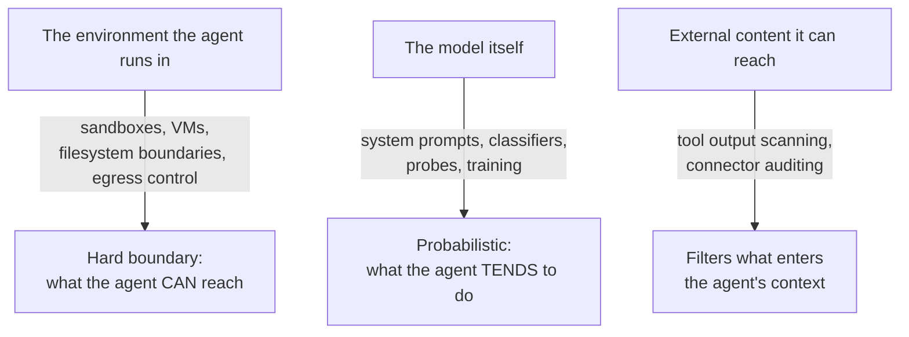
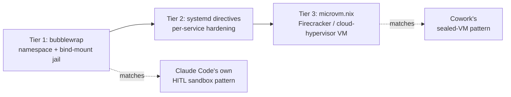

# Agent Sandboxing

Personal reference notes. Primary source: [Anthropic — How we contain Claude across products](https://www.anthropic.com/engineering/how-we-contain-claude) (May 2026). Tooling sources: [anthropic-experimental/sandbox-runtime](https://github.com/anthropic-experimental/sandbox-runtime), [Claude Code sandboxing docs](https://code.claude.com/docs/en/sandboxing), [microvm.nix](https://microvm-nix.github.io/microvm.nix/), [NixOS Wiki / systemd hardening references].

## 1. Where this sits, and how it differs from "permissions"

Sandboxing is the **environment layer** of the four-layer harness security model from `07-harness-engineering.md` (Model / Harness / Tools / **Environment**). It is deliberately a different kind of defense than the permission classifiers covered there:

| | Permissions (`07-harness-engineering.md`) | Sandboxing (this file) |
|:---|:---|:---|
| What it does | Supervises what the agent *does* — asks, classifies, approves | Supervises what the agent is *able to* do — hard boundary |
| Enforcement | Probabilistic (a classifier, a human click) | Deterministic (a syscall filter, a network namespace, a hypervisor) |
| Failure mode | Has a non-zero miss rate by construction | Fails only if the boundary itself has a bug |
| Best for | Steering behavior, reducing friction | The backstop when steering fails |

Anthropic's own framing, worth internalizing directly: **design for containment at the environment layer first, then steer behavior at the model layer** — because in their most costly incidents, the model layer had nothing anomalous to catch. A user typing a malicious prompt, or an agent following a legitimate-looking instruction, looks identical to normal use from inside the model's reasoning. Only a boundary that doesn't care about intent stops it.

## 2. Three risk types, three defended components

Risks to a sandboxed agent fall into three categories:

- **User misuse** — the user (maliciously or carelessly) directs the agent to do something harmful.
- **Model misbehavior** — the agent takes a harmful action nobody asked for, including "helpfully" routing around a restriction to complete a task it was given.
- **External attackers** — the agent is attacked through tools, files, or network access it's exposed to (prompt injection, supply-chain compromise).

Defenses apply to three components, and they're deliberately redundant — when one layer is unavailable, another has to pick up the slack:



## 3. Three isolation patterns

Anthropic ships three different containment architectures across claude.ai, Claude Code, and Cowork — not because one is "best," but because each matches a different audience's capacity to supervise the agent themselves.

| Pattern | Mechanism | Used for | Blast radius if compromised |
|:---|:---|:---|:---|
| **Ephemeral container** | gVisor + per-session, per-tenant isolated infra; agent is entirely server-side | claude.ai code execution | A throwaway container; no persistent workspace, no host filesystem access |
| **HITL sandbox** | OS-level sandbox (Seatbelt on macOS, **bubblewrap** on Linux); reads allowed, writes allowed inside workspace, network denied by default | Claude Code — developer-facing, local machine | The local workspace directory |
| **Sealed VM** | Full hypervisor isolation (own kernel, filesystem, process table); only a user-selected folder is mounted; credentials never enter the guest | Claude Cowork — non-technical users, general knowledge work | Only the mounted workspace, until the user adds connectors |

**The principle behind the choice**: match isolation strength to the user's capacity for oversight. A developer who can read a bash command and knows what `rm -rf` does can be trusted with a lighter boundary plus their own judgment; someone who can't evaluate `find . -name "*.tmp" -exec rm {} \;` needs a boundary that's absolute and doesn't ask them to judge anything. Getting this wrong in either direction is its own failure — too much friction annoys an expert into disabling the safeguard, too much trust exposes someone who can't evaluate what they're approving.

Concrete numbers behind these choices: the OS-level sandbox in Claude Code produced an **84% reduction in permission prompts** versus asking per-action, because most reads/writes inside the workspace no longer need a human decision at all. Claude Opus 4.7 holds prompt-injection attack success to roughly 0.1% on a single attempt (5-6% after 100 adaptive attempts) — strong, but explicitly *not* sufficient alone, which is why the environment layer exists as backstop rather than decoration.

## 4. The lesson that isn't obvious: an allowlist is a capability grant, not a filter

This is the single most important non-obvious finding in Anthropic's postmortems, and it applies directly to your planned custom MCP server (`08-running-llms-locally.md` §6) and to any egress rule you write:

An egress allowlist for `api.anthropic.com` was added because the product legitimately needs to call Anthropic's own API. A malicious file in a mounted workspace carried an attacker-controlled API key alongside its instructions. The agent, following those instructions, called the Files API using *that* key. The proxy checked the destination — `api.anthropic.com` — saw it was on the allowlist, and passed it through. The sandbox worked exactly as designed. The data still left, uploaded to the attacker's own account under the attacker's own key.

**Reframe every allowlist entry you write**: you're not asking "is this domain okay to talk to," you're asking "what is every function reachable through this domain, and am I okay granting *all* of them." Allowing a domain for read access can silently also allow uploads, arbitrary API calls, or account actions under attacker-supplied credentials, if the proxy only checks the hostname and not the credential or the specific operation.

The fix that held: a **defensive proxy inside the trust boundary** that validates the credential itself, not just the destination — rejecting any request that doesn't carry the sandbox's own provisioned, scoped token, even when the hostname is correctly allowlisted.

## 5. Postmortem gotchas worth pre-empting

Three specific failures worth checking your own setup against, since each is a category of mistake rather than a one-off bug:

- **Nothing before the trust prompt should execute.** Claude Code's early vulnerabilities all shared one shape: project-local configuration (a hook defined in a settings file) got parsed and run *before* the user had approved trusting the folder at all. If you build anything that reads local config, project files, or listens on localhost, treat that input exactly like an inbound request from the internet — establish the trust boundary before anything from the untrusted side executes, not after.
- **Symlink resolution must happen before path validation, not after.** A symlink inside an otherwise-authorized directory can point anywhere on the host. Validate the *resolved* real path against your allowed set, not the path string you were handed.
- **The user themselves is a valid injection vector.** A phishing email with a plausible "can you run this for me?" prompt got an employee to launch an agent with instructions to read `~/.aws/credentials` and exfiltrate it — successfully, 24 times out of 25 attempts. Because the instruction arrived *through the user typing it*, there was nothing for a model-layer classifier to flag as anomalous. Only environment-layer defenses — egress controls that block the destination regardless of intent, and filesystem boundaries that keep credential paths out of reach in the first place — held here. Don't design a system where "the user typed it" is treated as inherently safe.
- **Isolation strong enough to contain the agent is also strong enough to blind your own monitoring.** VM-level isolation kept host-based endpoint detection tooling from seeing inside the guest too. If you have any monitoring or audit requirement, budget for this trade-off explicitly rather than discovering it after the sandbox ships.

## 6. NixOS-native implementation, three tiers

Map the three Anthropic patterns above onto tooling that actually exists on your system, from lightest to heaviest:



### Tier 1 — bubblewrap (matches Claude Code's own approach)

This is literally what Claude Code's built-in `/sandbox` uses on Linux — filesystem namespace isolation plus bind-mounts, with network denied by default and routed through an HTTP/SOCKS5 proxy when it is allowed (the network namespace is removed entirely from the container, so *all* traffic is forced through the proxy — there's no path around it). Anthropic open-sourced this as [`sandbox-runtime`](https://github.com/anthropic-experimental/sandbox-runtime) (`srt`).

For your own tools or a custom MCP server that shells out, `bubbLLMwrap` is a ready-made Nix flake wrapping the same primitive with a declarative profile API:

```nix
# flake.nix — add as an input
{
  inputs.bubbllmwrap.url = "github:tomeon/bubbLLMwrap";
}
```

```nix
# Example profile — adapt into your own flake's devShell or a wrapper script.
# deriveProfile builds a named sandbox config from a base profile plus overrides.
let
  restrictedAgent = bwLib.deriveProfile bwLib.base {
    name = "restricted-agent";
    env = {
      # env vars visible INSIDE the sandbox only — the host's full environment
      # is not inherited by default, which is the point.
      LOG_LEVEL = "info";
    };
    preStartHooks = [
      # Runs on the host before the jail is entered — use it to load a scoped
      # secret rather than passing your full-privilege credential in.
      ''export ANTHROPIC_API_KEY="$(cat /run/secrets/scoped-agent-key)"''
    ];
  };
in restrictedAgent
```

Bare `bwrap` invocation, for anything not going through a wrapper — the flags that matter, matched to Claude Code's own defaults:

```bash
bwrap \
  --ro-bind /nix/store /nix/store \    # read-only: needed to run Nix-built binaries at all
  --bind "$PWD" "$PWD" \               # read-write: only the current project directory
  --tmpfs /tmp \                       # fresh, isolated /tmp per run
  --unshare-net \                      # no network namespace = no network, full stop
  --unshare-pid \                      # can't see or signal host processes
  --die-with-parent \                  # sandbox dies if the supervising process does
  -- claude
```

`--unshare-net` is the blunt version of Claude Code's proxy approach — no network at all, rather than filtered network. Use it for anything that shouldn't need network access in the first place (a local build step, a test run); reach for a proxy-based setup only when the agent genuinely needs *some* egress.

### Tier 2 — systemd sandboxing directives (for services you already run)

This applies directly to the `llama-server` systemd unit from `08-running-llms-locally.md` §5, and to any custom MCP server you run as a persistent service rather than an ad hoc process. Add a hardening block under the same `serviceConfig`:

```nix
# /etc/nixos/configuration.nix — extending the llama-server service from 08-running-llms-locally.md
# Add these keys into the existing systemd.services.llama-server.serviceConfig block.

systemd.services.llama-server.serviceConfig = {
  # (ExecStart, Restart, etc. from 08-running-llms-locally.md stay as-is — this only adds hardening)

  NoNewPrivileges = true;        # process (and children) can never gain privileges via setuid/setgid
  ProtectSystem = "strict";      # entire filesystem read-only except paths explicitly listed below
  ProtectHome = true;            # /home, /root, /run/user invisible to the service
  PrivateTmp = true;             # isolated /tmp, not shared with other services
  PrivateDevices = true;         # no access to physical devices — safe since this is CPU/GPU-via-CUDA, not raw device access
  ProtectKernelTunables = true;  # can't read/write /proc/sys, /sys kernel tunables
  ProtectKernelModules = true;   # can't load/unload kernel modules
  ProtectControlGroups = true;   # can't modify cgroup hierarchy
  RestrictAddressFamilies = [ "AF_INET" "AF_INET6" "AF_UNIX" ];  # no exotic network protocols
  ReadWritePaths = [ "/var/lib/llama-models" ];  # the one path it actually needs write access to, if any
};
```

Verify the effect directly rather than trusting the config by eye:

```bash
systemd-analyze security llama-server.service
```

This prints a per-directive exposure score — treat a shrinking score after each change as your feedback loop, the same way you'd treat a passing test suite.

### Tier 3 — microvm.nix (matches Cowork's sealed-VM pattern)

For anything that should be able to fail completely without touching the host — an experimental agent run, an untrusted MCP server, or a herdr instance you don't want sharing your home directory at all — `microvm.nix` gives you real hypervisor isolation (Firecracker or cloud-hypervisor) declared the same way you declare any other NixOS system:

```nix
# flake.nix
{
  inputs = {
    nixpkgs.url = "github:NixOS/nixpkgs/nixos-25.11";
    microvm.url = "github:microvm-nix/microvm.nix";
    microvm.inputs.nixpkgs.follows = "nixpkgs";  # avoid a second, unpinned nixpkgs copy
  };

  outputs = { self, nixpkgs, microvm, ... }: {
    nixosConfigurations.agent-vm = nixpkgs.lib.nixosSystem {
      system = "x86_64-linux";
      modules = [
        microvm.nixosModules.microvm
        {
          networking.hostName = "agent-vm";
          microvm.hypervisor = "cloud-hypervisor";  # good default; firecracker is lighter but more restrictive on devices
          microvm.vcpu = 4;
          microvm.mem = 4096;  # MB — sized for an agent + local tooling, not the 7B model itself
          microvm.shares = [{
            # Share only a project directory in, not the whole host filesystem
            source = "/home/you/projects/current-task";
            mountPoint = "/workspace";
            tag = "workspace";
            proto = "virtiofs";
          }];
          # No network share declared here = no network by default; add one
          # deliberately, scoped, if the task genuinely needs egress.
        }
      ];
    };
  };
}
```

Run it with `nix run .#agent-vm`. This is the direct NixOS analogue of Cowork's design decision: the guest has its own kernel and process table, only the declared share is visible, and credentials on the host keychain never need to enter the guest at all — you'd inject a scoped token via a `preStartHook`-equivalent (a share-mounted secrets file) exactly as in the bubblewrap example, not by copying your real credentials in.

## 7. Sandboxing and herdr: isolation vs. coordination, again

`07-harness-engineering.md` §5 already flagged this distinction for multi-instance harnesses — it's worth restating specifically for security, because it's easy to conflate the two: **git worktrees prevent file collisions between concurrent agent instances; they do nothing to contain what a single instance can do.** A herdr-supervised session working in its own worktree, run with your real API keys and full filesystem access, is exactly as dangerous as one running in your main tree if either one is compromised or misdirected — the worktree only stops two agents from stepping on each other's edits.

If you're running several herdr-supervised agents concurrently with real credentials, each one is a separate security boundary, not just a separate working directory:

- Each instance that touches untrusted content (fetched web pages, cloned repos, MCP tool output) is a separate blast-radius unit — Tier 1 (bubblewrap) per instance is the low-overhead default.
- An instance you're deliberately running unattended, headless, for longer stretches — closer to Claude Code's `auto mode` use case than an interactive session — is where the cost of Tier 3 (a real VM) starts being worth it, because there's no human in the loop to notice drift.
- Scoped credentials per instance beat one shared credential across all of them — if one instance's sandbox has a bug, a scoped token limits what leaks; a shared token turns any one compromise into a compromise of everything.

## 8. Decision table

| Situation | Tier | Why |
|:---|:---|:---|
| Interactive coding session, you're watching | Tier 1 (bubblewrap) or none, backed by permission prompts | You're the oversight; sandboxing reduces friction, doesn't replace your attention |
| A persistent local service (llama-server, a custom MCP server) | Tier 2 (systemd directives) | It's not "an agent," it's a long-running process — harden it like any other service |
| Any process handling untrusted fetched content or cloned repos | Tier 1 minimum, network denied unless proven necessary | Prompt injection lives in tool output and file content, not just direct instructions |
| Unattended / headless / long-running herdr instance | Tier 3 (microvm.nix) | No human in the loop to catch drift — the boundary has to be the whole defense |
| Anything touching real credentials alongside untrusted input | Tier 3 + scoped, per-instance tokens, never the master credential | This is precisely the phishing/exfiltration failure mode from §5 |

## 9. Checklist

- [ ] Every allowlisted egress destination re-examined as "what can be *done* through this," not just "is this domain trusted"
- [ ] Nothing (config parsing, hooks, localhost listeners) executes before a trust boundary is established
- [ ] Path validation happens after symlink resolution, not before
- [ ] Credentials are scoped per sandbox/instance, never the full-privilege token copied in
- [ ] Persistent services (llama-server, MCP servers) have systemd hardening applied and verified with `systemd-analyze security`
- [ ] Concurrent herdr instances are isolated as separate security boundaries, not just separate git worktrees
- [ ] Headless/unattended agent runs get the heaviest tier available (VM), since no human is watching for drift
- [ ] You're relying on battle-tested primitives (bubblewrap, systemd, a real hypervisor) rather than a custom-built boundary — the recurring lesson across every documented failure is that the custom piece is the one that breaks

---
*Part of a 12-file reference set: prompt engineering → tools → skills → context engineering → RAG → MCP → harness engineering → running LLMs locally → agent sandboxing → loop engineering → hooks → sandboxing.*
