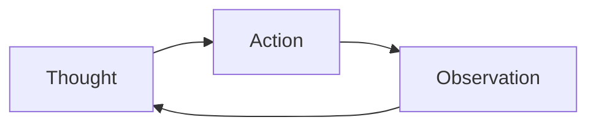
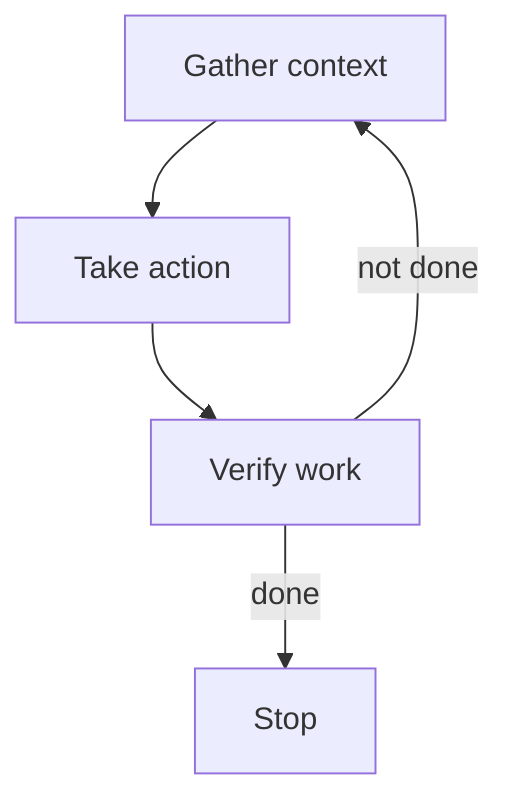
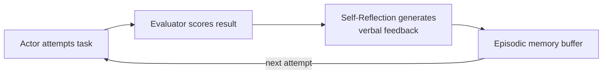

# Loop Engineering

Personal reference notes. Sources: [Anthropic — Building agents with the Claude Agent SDK](https://claude.com/blog/building-agents-with-the-claude-agent-sdk), [ReAct: Synergizing Reasoning and Acting in Language Models (Yao et al., ICLR 2023)](https://arxiv.org/abs/2210.03629), [Reflexion: Language Agents with Verbal Reinforcement Learning (Shinn et al., NeurIPS 2023)](https://arxiv.org/abs/2303.11366), plus current practitioner writing on loop termination (cited inline, treated as directional rather than authoritative).

## 1. Scope: the loop is one box inside the harness

`07-harness-engineering.md` drew a harness as five components — loop, tool registry, context manager, permission gate, state persistence — and moved on. **Loop engineering zooms into that first box.** It's the discipline of designing the actual control cycle: what triggers the next model call, what goes into it, and — the part most naive implementations get wrong — what makes it stop.

| Layer | Question | File |
|:---|:---|:---|
| Prompt engineering | What do I say this turn? | `01-prompt-engineering.md` |
| Context engineering | What surrounds the prompt? | `04-context-engineering.md` |
| Harness engineering | What scaffolding runs the loop, calls tools, persists state? | `07-harness-engineering.md` |
| **Loop engineering** | **What decides the next step, and when does it stop?** | **this file** |

The term itself is recent and informally coined — no lab has published a paper called "loop engineering." It surfaced in practitioner writing around mid-2026 as a name for something people were already doing: designing the *gather → act → verify → stop* cycle deliberately, rather than hand-prompting an agent and hoping it converges. Treat the term as useful shorthand, not a citation-bearing concept — the underlying mechanics below are individually well established.

## 2. The academic foundation: ReAct

**ReAct** (Reason + Act, Yao et al., ICLR 2023) is the paper that established interleaving reasoning traces with actions as a coherent pattern, and it's a genuinely replicated result, not a single team's claim. The core idea: at each step $t$, the agent receives an observation $o_t$ from the environment and takes an action $a_t$ following a policy $\pi(a_t \mid c_t)$, where $c_t = (o_1, a_1, \ldots, o_{t-1}, a_{t-1}, o_t)$ — the full history of what it's seen and done so far.

The finding that mattered: reasoning-only (chain-of-thought) hallucinates because it's never grounded in anything outside the model's own weights, while acting-only fails to synthesize a coherent answer because it has nothing to reason *over*. Interleaving both — a thought explaining why, an action that changes the world, an observation reporting what happened — outperformed either alone, and did so few-shot, without fine-tuning. On question-answering and fact-verification benchmarks (HotpotQA, Fever) ReAct reduced hallucination and error propagation relative to chain-of-thought; on interactive decision-making benchmarks (ALFWorld, WebShop) it beat imitation and reinforcement learning baselines by 34 and 10 absolute percentage points respectively. This shape — thought, action, observation, repeat — is the ancestor of essentially every production agent loop that followed.

## 3. The production shape: gather context → take action → verify work → repeat

This is Anthropic's own description of the loop that powers Claude Code and the Claude Agent SDK — a direct descendant of ReAct, specialized for a computer-using agent rather than a text-only one.

**Gather context.** Prefer *agentic search* — the agent using `grep`, `tail`, and the filesystem itself to pull only what the next step needs — over pre-computed *semantic search* (RAG, per `05-rag.md`). Agentic search is slower per-lookup but more accurate, more transparent, and easier to maintain; add semantic search only once you need the speed. **Subagents** serve this stage two ways: parallelizing exploration across independent subtasks, and isolating context — a subagent burns its own context window doing the searching and returns only a condensed result to the parent loop, rather than flooding it with everything it read. **Compaction** (per `04-context-engineering.md`) keeps a long-running loop from simply running out of room as history accumulates.

**Take action.** Tools are the primary unit of action and the most context-prominent thing in the loop — this is why `02-tools.md`'s design discipline matters so much here specifically. Bash and code generation round out the action space for anything a fixed tool set doesn't cover; code is precise, composable, and reusable in a way free-text output isn't, which is why it's the right output for anything requiring exact, repeatable structure (per `03-skills.md`'s determinism gradient). MCP (`06-mcp.md`) extends the action space to whatever external services are connected, without custom integration code per service.

**Verify work.** Three approaches, ranked by reliability rather than treated as interchangeable:

| Method | Reliability | Cost |
|:---|:---|:---|
| Rules-based (linting, explicit validation, typed output) | Highest — deterministic, explains exactly what failed and why | Cheapest |
| Visual feedback (screenshots, rendered output, browser automation) | High for visual/UI tasks specifically | Moderate — needs the tooling (e.g., a Playwright MCP server) |
| LLM-as-judge (a separate model scores the output against fuzzy rules) | Lowest — genuinely "not very robust" per Anthropic's own framing | Highest — added latency, a second model call |

The ordering matters: reach for rules-based verification first, and only fall back to LLM-as-judge when the criteria are too fuzzy to encode as a rule. This is the same principle as `07-harness-engineering.md`'s planner/generator/**evaluator** split — a separate evaluator counters the tendency of a model to overrate its own output — applied at the single-loop-iteration scale instead of the multi-agent scale.

**Repeat**, until verification says done or a stopping condition (Section 5) fires.

## 4. The self-refinement variant: Reflexion

Where ReAct's loop is single-pass per task, **Reflexion** (Shinn et al., NeurIPS 2023) adds a memory-carrying refinement loop across *attempts* at the same task. Three roles: an **Actor** that generates text and actions, an **Evaluator** that scores the Actor's output, and a **Self-Reflection** model that converts that score into verbal feedback — written in natural language, not a gradient update — which gets appended to an episodic memory buffer the Actor reads on its next attempt.

This is a genuinely different loop shape from Section 3's single pass: it's a loop *around* the gather-act-verify cycle, where "verify" failing doesn't just trigger another action, it triggers a written self-critique that persists into the next full attempt. The paper's own benchmark result — 91% pass@1 on HumanEval, against an 80% GPT-4 baseline without Reflexion — is specific to that paper's setup; treat it as evidence the pattern works, not as a number that transfers directly to your own task. The practical takeaway that does transfer: when verification fails, writing down *why* in natural language and carrying that forward outperforms simply retrying with no memory of the failure.

## 5. Termination: the part naive loops get wrong

A loop that only ends because an iteration cap fired is a loop whose ending was never actually designed — this is the specific failure loop engineering as a discipline exists to fix. Three root causes show up repeatedly across current production writeups:

- **Goal ambiguity.** The loop has no crisp representation of "done," so a partially-useful result can't be classified as sufficient or insufficient — the agent just acts again to be safe.
- **Tool-output misinterpretation.** The agent can't reliably tell a success result from a failure result, so it retries a call that already succeeded, or never retries one that actually failed.
- **No memory of past attempts.** Without a fingerprint of what it already tried, the agent can't distinguish "trying a new approach" from "doing the identical thing a third time."

**Concrete guardrails**, from weakest to strongest:

1. **Max iteration / max execution time cap.** A hard backstop, not a fix — it stops the bleeding after the loop has already burned through however many steps the cap allows. Every serious source treats this as necessary but insufficient on its own.
2. **Action deduplication.** Hash each `(tool, args)` pair; if the identical call appears `k` times, break rather than retry. One formalization worth keeping: a loop is detected when the same action hash appears twice within a sliding window of size $W$ — $\exists\, i < j \le t : \text{hash}(a_i) = \text{hash}(a_j) \land j - i \le W$. Small $W$ catches tight repetition fast; too small a $W$ risks false-positiving on legitimate repeated calls (e.g., polling a job status).
3. **No-progress / state-change detection.** Broader than exact-action dedup — if the agent's state (files changed, data retrieved, sub-goals completed) hasn't moved in `k` steps even though the *actions* varied, that's still stuck, just stuck in a wider circle.
4. **A graceful-failure ladder**, rather than a binary continue/abort. One documented shape: reflect (surface the repetition to the model explicitly and ask it to reassess), suggest a pivot (name an alternative tool or approach), compress and restart reasoning (summarize everything, clear working state, try once more with a clean slate), then a graceful exit reporting partial results and what blocked completion. This preserves the "explain what was accomplished, explain why it couldn't finish, suggest a recovery action" shape that shows up independently in academic evaluation-harness writing as the correct behavior for an agent that genuinely cannot complete a task.

**The cost angle matters as much as the correctness angle.** Every loop iteration is a model call; an undetected stuck loop is a runaway bill before it's anything else, and evaluation studies on real agent transcripts have found repetitive-action failures in a double-digit percentage of samples for some models — treat any specific figure like this as belonging to that one study's setup, not a universal rate, but treat the *existence* of the failure mode as something to design against by default, not something to patch reactively after your first surprise invoice.

## 6. Loop budget as a deliberate parameter, not a default

Three separate budget axes, each worth setting on purpose:

| Budget | Controls | Where it's set |
|:---|:---|:---|
| Iteration cap | How many gather→act→verify cycles before forced stop | Harness-level constant |
| Thinking budget | How much reasoning per individual step | The `effort` parameter (`01-prompt-engineering.md` §5) |
| Time / wall-clock budget | How long the whole loop may run | Harness-level timeout |

These are independent knobs. A tight iteration cap with an unbounded thinking budget still lets one step run arbitrarily long; a generous iteration cap with a tight time budget cuts the loop off mid-task regardless of how many steps it's used. Pick values deliberately against the task's actual shape — a quick lookup and a multi-hour migration should not share a default.

## 7. Leaving room for interruption

`09-agent-sandboxing.md` noted that experienced users interrupt an agent mid-execution more than they gate individual steps — which means the loop has to support being paused cleanly, not just running to a predetermined stop. A loop designed for supervised, long-running operation (exactly herdr's use case, supervising several concurrent loops via tmux) needs:

- **A safe interrupt point** — between iterations, not mid-tool-call, so a paused loop resumes from a clean state rather than a half-applied action.
- **Visible, inspectable state** at any point — the same structured note-taking or progress-file pattern from `04-context-engineering.md` and `07-harness-engineering.md`'s initializer/coding-agent split serves double duty here: it's what a human (or you, checking a herdr pane) reads to understand where the loop actually is.
- **Resume, not restart, as the default** — cheap resumption from persisted state is what makes interruption safe to use casually; if resuming is as expensive as starting over, nobody will actually interrupt when they should.

## 8. Nested and parallel loops

Two ways loops compose, both already covered structurally in `07-harness-engineering.md` and worth only a pointer here: a **subagent** is a nested loop — its own gather-act-verify cycle running to completion inside one "take action" step of the parent's loop (Section 3). Multiple **herdr-supervised instances** are parallel loops, each independently cycling, coordinated externally (via git, a shared task file, or a human) rather than sharing loop state directly. Termination design (Section 5) applies per-loop in both cases — a stuck subagent should be detected and cut off without necessarily killing the parent loop it's nested inside.

## 9. Checklist

- [ ] The loop has an explicit, checkable definition of "done" — not left for the model to sense on its own
- [ ] Verification is rules-based wherever a rule can be written; LLM-as-judge only where it genuinely can't
- [ ] An iteration cap exists, but isn't the only termination mechanism
- [ ] Action deduplication or state-change detection catches stuck loops well before the iteration cap does
- [ ] A graceful-failure path exists — partial results plus a clear explanation, not just a hard abort
- [ ] Iteration, thinking, and time budgets are each set deliberately for the task's actual shape
- [ ] The loop has a safe interrupt point and resumes from persisted state rather than restarting
- [ ] Nested (subagent) and parallel (multi-instance) loops each have their own termination logic, not one shared assumption

---
*Part of a 12-file reference set: prompt engineering → tools → skills → context engineering → RAG → MCP → harness engineering → running LLMs locally → agent sandboxing → loop engineering → hooks → sandboxing.*
