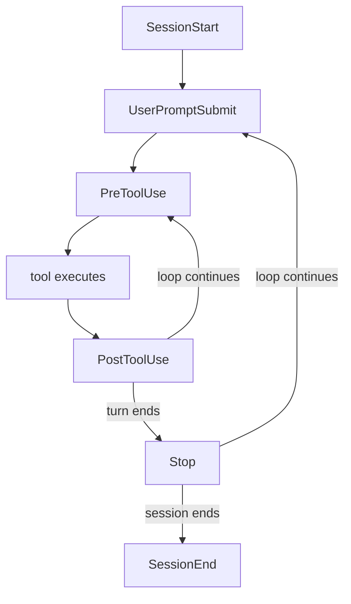

# Hooks

Personal reference notes. Primary source: [Claude Code - Hooks reference](https://code.claude.com/docs/en/hooks).

## 1. What a hook is, in one sentence

A **hook** is a shell command (or HTTP endpoint, MCP tool call, or model prompt) that Claude Code runs automatically at a fixed point in its lifecycle - a tool call, a session start, a turn ending - **regardless of whether the model decides to call anything**. That's the whole distinction from a tool worth holding onto: a tool is something the model *chooses* to invoke; a hook *fires on its own* when its trigger condition is met. This makes hooks the concrete implementation of `07-harness-engineering.md`'s "script" end of the determinism gradient, wired directly into `10-loop-engineering.md`'s loop rather than waiting for the model to decide to act.

## 2. The lifecycle, at the altitude that matters

Claude Code defines on the order of thirty hook events. Most work happens on a handful of them:



Events fall into three cadences: **once per session** (`SessionStart`, `SessionEnd`), **once per turn** (`UserPromptSubmit`, `Stop`), and **on every tool call inside the agentic loop** (`PreToolUse`, `PostToolUse`). The events worth knowing well:

| Event | Fires | Typical use |
|:---|:---|:---|
| `SessionStart` | New session or resume | Load git status, recent issues, or env vars into context |
| `UserPromptSubmit` | User submits a prompt, before Claude processes it | Prompt validation, context augmentation |
| `PreToolUse` | Before a tool call executes | Block dangerous commands, rewrite tool input |
| `PostToolUse` | After a tool call succeeds | Auto-format, lint, log, inject follow-up context |
| `Stop` | Claude finishes responding | Force continuation if validation hasn't passed yet |
| `SubagentStart` / `SubagentStop` | A subagent spawns / finishes | Per-subagent logging, resource cleanup |
| `PreCompact` | Before context compaction | Back up the transcript before it's summarized away |
| `SessionEnd` | Session terminates | Cleanup, session statistics |

The rest - `WorktreeCreate`, `FileChanged`, `Elicitation`, and about twenty others - exist for narrower cases; look them up when you need them rather than memorizing the full set.

## 3. Configuration anatomy

Three levels of nesting, always: **event** → **matcher** (what narrows it) → **handler** (what runs).

```json
{
  "hooks": {
    "PreToolUse": [
      {
        "matcher": "Bash",
        "hooks": [
          {
            "type": "command",
            "command": "${CLAUDE_PROJECT_DIR}/.claude/hooks/block-rm.sh"
          }
        ]
      }
    ]
  }
}
```

The matcher filters *which* occurrences of the event trigger the handler - `"Bash"` matches only the Bash tool, `"Edit|Write"` matches either, `mcp__memory__.*` matches every tool from a specific MCP server (per `06-mcp.md`'s naming convention), and `"*"` or an omitted matcher fires on every occurrence. An optional per-handler `if` field narrows further using the same permission-rule syntax as `07-harness-engineering.md`'s permission gate - `"Bash(rm *)"` matches only when the actual Bash subcommand looks like `rm ...`, so the handler only spawns when it's actually relevant.

**Where a hook lives determines its scope and shareability:**

| Location | Scope | Shareable |
|:---|:---|:---|
| `~/.claude/settings.json` | Every project, your machine only | No |
| `.claude/settings.json` | This project | Yes - commit it |
| `.claude/settings.local.json` | This project | No - gitignored |
| Managed policy settings | Organization-wide | Yes, admin-controlled |
| Plugin `hooks/hooks.json` | Active while the plugin is enabled | Yes, bundled with the plugin |
| Skill or subagent frontmatter | Active only while that component runs | Yes, defined in the component file |

That last row matters for Section 6 below.

## 4. The exit-code semantics - the part that trips people up

The single most common mistake: **exit code 1 does not block anything.** For most events, Claude Code treats any exit code other than 2 as non-blocking - the action proceeds regardless. **Exit code 2 is the blocking signal.** On events that can block (`PreToolUse`, `UserPromptSubmit`, `Stop`, and a handful of others), exit 2 stops the action even if the hook also printed JSON saying `"allow"` - exit 2 wins.

```bash
#!/bin/bash
# Reads JSON on stdin, blocks destructive rm commands.
input=$(cat)
command=$(jq -r '.tool_input.command' <<<"$input")

if [[ "$command" == rm* ]]; then
  echo "Blocked: rm commands are not allowed" >&2
  exit 2   # blocking - the tool call is prevented
fi

exit 0     # no decision - normal permission flow applies
```

For finer control than a binary block/allow, exit 0 and print a JSON object to stdout instead. `PreToolUse` accepts a `permissionDecision` (`allow` / `deny` / `ask`) plus a human-readable reason, and can even rewrite the tool's input before it runs via `updatedInput`. `PostToolUse` can inject `additionalContext` - text the model reads on its next turn - which is the concrete mechanism behind `10-loop-engineering.md`'s "rules-based verification": a linter runs as a `PostToolUse` hook, and a failure gets reported back to the model as context rather than silently logged.

## 5. Five hook types, one reliability spectrum

| Type | What runs | Reliability |
|:---|:---|:---|
| `command` | A shell command, reading JSON on stdin | Deterministic - the default choice |
| `http` | A POST request to your own endpoint | Deterministic, adds a network hop |
| `mcp_tool` | A tool call on an already-connected MCP server | Deterministic, depends on that server's own reliability |
| `prompt` | A single-turn prompt to a (usually fast) model, returning yes/no | Probabilistic |
| `agent` | A subagent with real tools (Read, Grep, Glob) that investigates before deciding | Probabilistic, higher latency, experimental |

The last two exist for genuinely fuzzy conditions a rule can't express - but reaching for them recreates exactly the reliability trade-off `10-loop-engineering.md` §3 already flagged for LLM-as-judge verification: least robust, highest latency, use only when a deterministic rule truly can't capture the check.

## 6. Hooks inside skills: the two aren't either/or

A skill's frontmatter can declare its own hooks, scoped to that skill's own lifecycle and automatically cleaned up when the skill finishes running:

```yaml
---
name: secure-database-operations
description: Perform database operations with mandatory safety checks. Use when the user asks to run migrations, seed data, or modify schema.
hooks:
  PreToolUse:
    - matcher: "Bash"
      hooks:
        - type: command
          command: "./scripts/require-backup-check.sh"
---
```

This means a skill can *ship its own deterministic guardrail* alongside the procedural knowledge in its body - the skill teaches the model how to think about the task, and its bundled hook enforces the one part of that task that shouldn't be left to the model's judgment at all. Section 7 below covers when to reach for this pattern versus keeping the two separate.

## 7. Security: hooks execute with real privileges, and timing matters

`09-agent-sandboxing.md` §5 already documented the exact failure this section is warning about: Claude Code shipped vulnerabilities where a project-local `.claude/settings.json` defined a hook, and because project settings load *before* the "do you trust this folder?" prompt, an attacker-authored hook in a cloned repository executed automatically - before the user had consented to anything. The fix was deferring config parsing until after the trust boundary. The general rule it teaches: **anything that can define a hook is exactly as sensitive as a script you'd run directly**, because that's what it is.

Two consequences worth carrying forward:

- A hook is not sandboxed just because it's "only a hook." Apply `09-agent-sandboxing.md`'s tiers to hook scripts the same way you'd apply them to any other script - a hook that shells out to touch real credentials deserves the same scrutiny as any bundled skill script.
- Review hooks from any source you didn't write yourself (a plugin, a shared team settings file, a skill someone else published) with the same audit procedure as `03-skills.md` §8 - read the script, check what it reaches, don't assume "it's just a hook" means low stakes.

## 8. Checklist

- [ ] Used `exit 2` for blocking, not `exit 1` - and confirmed the target event actually supports blocking
- [ ] Matcher is as narrow as the use case allows (a specific tool or MCP server, not `"*"`) to avoid firing on irrelevant calls
- [ ] Deterministic `command`/`http`/`mcp_tool` handlers used wherever a rule can be written; `prompt`/`agent` reserved for genuinely fuzzy checks
- [ ] Hook location matches intended scope - project-shareable in `.claude/settings.json`, personal-only in `settings.local.json`
- [ ] Any hook from an external source (plugin, shared settings, someone else's skill) has been read in full before being enabled
- [ ] A skill's bundled hook is used only for the one part of its task that genuinely shouldn't be left to model judgment - not as a substitute for writing the skill's procedure well

---
*Part of a 12-file reference set: prompt engineering → tools → skills → context engineering → RAG → MCP → harness engineering → running LLMs locally → agent sandboxing → loop engineering → hooks → sandboxing.*
