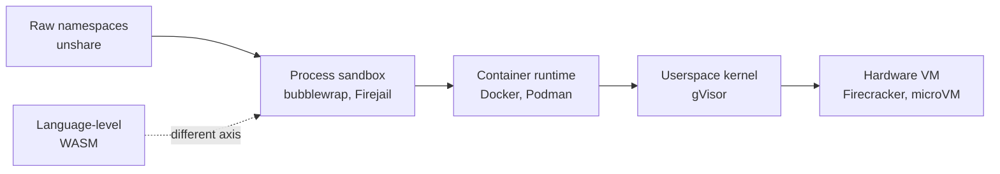
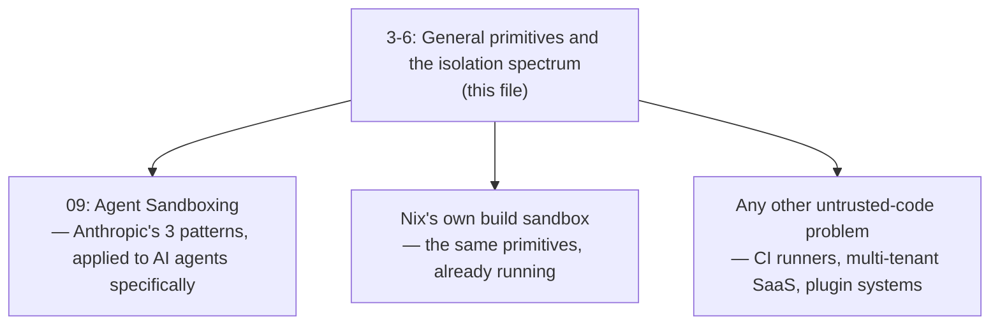

# Sandboxing

Personal reference notes. Sources: [man7.org — namespaces(7)](https://man7.org/linux/man-pages/man7/namespaces.7.html), [Nix Reference Manual — nix.conf sandbox option](https://nixos.org/manual/nix/stable/command-ref/conf-file.html), plus current comparative writing on gVisor/Firecracker cited inline.

## 1. Scope: this file vs. `09-agent-sandboxing.md`

`09-agent-sandboxing.md` answers *how do I contain an AI agent specifically* — Anthropic's three product-level patterns, and a decision tree for which NixOS tool (bubblewrap, systemd, microvm.nix) fits which situation. This file is one level down: **the general-purpose isolation primitives those tools are built out of**, independent of whether what's running inside is an agent, a build script, a browser tab, or a stranger's code on a shared server. Read this file to understand *what bubblewrap and microvm.nix actually are*; read file 9 for *when to reach for each one with an agent specifically*.

## 2. What sandboxing is, stripped of any AI framing

A **sandbox** is a boundary between code you don't fully trust and the resources you don't want that code to reach — filesystem, network, other processes, the host kernel itself. Every sandbox design answers three questions, and the answers trade off against each other:

- **What's isolated?** Filesystem view, process visibility, network access, resource consumption, or the kernel interface itself — different mechanisms isolate different things, and most real sandboxes are several mechanisms stacked.
- **How strong is the boundary?** Logical separation (a process can't *see* something) is weaker than privilege restriction (a process *can't do* something even if it can see it), which is weaker than a genuinely separate kernel (there's nothing shared to attack).
- **What does it cost?** Every layer of isolation adds latency, memory, or engineering complexity. The strongest boundary available is rarely the right default for every workload.

## 3. The kernel-level primitives (Linux)

Everything above this layer — Docker, bubblewrap, Firejail, Kubernetes' pod isolation — is built by combining these. None of them, alone, is a complete security boundary.

| Primitive | Isolates | Notably does *not* provide |
|:---|:---|:---|
| **Namespaces** | A process's *view* of a resource (see table below) | Privilege restriction — a root process in a namespace is still root for anything the namespace doesn't cover |
| **cgroups** | Resource *consumption* — CPU, memory, I/O bandwidth, process count | Any isolation at all; this is a limiter, not a boundary |
| **Capabilities** | Root's monolithic privilege, split into ~40 independent bits (`CAP_NET_BIND_SERVICE`, `CAP_SYS_ADMIN`, etc.) | Isolation between processes that both hold the same capability |
| **seccomp** | Which *syscalls* a process may even attempt | Isolation of syscalls it's still allowed to make |
| **LSMs (AppArmor, SELinux)** | Mandatory, policy-defined access control layered on top of standard permissions | A sandbox by itself — these are usually deployed alongside the above, not instead of them |

**Namespaces** are the widest primitive and worth knowing individually — there are eight types on current Linux kernels:

| Namespace | Virtualizes |
|:---|:---|
| PID | Process IDs — a process can be PID 7 inside, PID 48213 outside |
| Mount | The filesystem mount table |
| Network | Interfaces, routing tables, ports |
| UTS | Hostname and NIS domain name |
| IPC | System V IPC objects and POSIX message queues |
| User | UID/GID mapping — lets a process be "root" inside while mapping to an unprivileged UID outside |
| Cgroup | The process's view of the cgroup hierarchy |
| Time | Boot and monotonic clock offsets |

The `unshare` command creates new namespaces directly from a shell — `unshare --pid --net --mount --fork bash` drops you into a process with its own PID, network, and mount view, no container runtime involved. This is the raw primitive that bubblewrap, Docker, and every container runtime wrap in more convenient tooling.

## 4. The isolation spectrum

From loosest to strongest, with the real trade-off at each step:



| Tier | Mechanism | Shares host kernel? | Cost |
|:---|:---|:---|:---|
| Process sandbox (bubblewrap, Firejail) | Namespaces + seccomp, no daemon | Yes, directly | Lowest — near-native speed |
| Container runtime (Docker, Podman) | Same primitives, plus image/registry tooling | Yes, directly | Low — convenience layer, not a stronger boundary than the row above |
| Userspace kernel (**gVisor**) | Intercepts syscalls in a sandboxed process (the **Sentry**) and reimplements them in userspace rather than passing them to the host kernel | Indirectly — the workload never talks to the real kernel for most calls | Moderate — near-native for CPU-bound work, meaningful overhead (10–40%+) on syscall- or filesystem-heavy work |
| Hardware VM (**Firecracker**, cloud-hypervisor, "microVM") | Real hardware virtualization via KVM; each workload gets its own kernel | No — a genuinely separate kernel | Highest per-instance overhead, but still lightweight relative to a traditional VM (Firecracker targets under 5 MiB overhead and ~100–200ms boot) |
| Language-level (WASM, V8 isolates) | Sandboxing at the bytecode/runtime level, not the OS level at all | N/A — different axis entirely | Very low, but no persistent filesystem or general OS access by default; requires the workload to target that runtime |

The gVisor/Firecracker distinction is worth holding precisely, since both get called "lightweight sandboxes" and they're not the same guarantee: **a gVisor escape is a process-level escape** — the attacker ends up talking to the Sentry or, in the worst case, the real host kernel through whatever narrow surface remains. **A Firecracker escape requires breaking a hardware-enforced VM boundary** — a categorically harder problem, because there's a real second kernel and a hypervisor in between, not just a process reimplementing kernel behavior. This is exactly why `09-agent-sandboxing.md` maps gVisor to claude.ai's ephemeral, server-side, multi-tenant containers (many tenants, high isolation *count* needed) and a full VM to Cowork's sealed-workspace pattern (fewer instances, but the strongest possible guarantee for each one).

## 5. Threat model: who's being protected from whom

The general question every sandbox answers, independent of what's inside it:

- **Host from guest** — the classic case: don't let the sandboxed code damage or read the machine it's running on.
- **Guest from guest** — multi-tenant isolation: two untrusted workloads on the same host must not be able to see or affect each other, even if neither can reach the host.
- **Both at once** — the hardest and most common real requirement, and the one that decides how strong a boundary you actually need. A single-tenant dev sandbox on your own machine only needs the first. A server running arbitrary workloads from many users needs both, which is why gVisor and Firecracker exist at all — plain namespaces satisfy neither guarantee once genuinely adversarial code is a possibility.

`09-agent-sandboxing.md`'s "three risk types" (user misuse, model misbehavior, external attackers) are a domain-specific instance of this same general question, asked with an AI agent as the untrusted party instead of an arbitrary workload.

## 6. Why namespaces alone are not a security boundary

This is the general version of the "don't build your own sandbox" lesson `09-agent-sandboxing.md` drew from Anthropic's postmortems, and it's worth understanding mechanically rather than just as received wisdom. A namespace changes what a process *can see*; it does not by itself change what that process *is allowed to do*. A process running as root inside a PID and mount namespace is still root — if it can reach a resource the namespace doesn't cover (a bind-mounted host path, a shared device node, a kernel interface not namespaced at all), root privilege there is exactly as dangerous as root privilege anywhere else. This is precisely why every serious process sandbox stacks primitives rather than relying on one: namespaces for visibility, **capabilities dropped** to remove privileges the process doesn't need, **seccomp** to block syscalls it shouldn't be making even with the capabilities it has, and ideally **not running as root inside the namespace at all** (a user namespace mapping "root inside" to an unprivileged UID outside closes exactly this gap).

## 7. NixOS: you're already running one of these

Two things worth knowing that go beyond file 9's bubblewrap/systemd/microvm.nix coverage:

**`systemd-nspawn`** is a third NixOS-native container primitive — lighter than a full VM, heavier than bare bubblewrap, and it's what `nixos-container` is built on. Reach for it when you want a full, boot-capable NixOS system in a namespace-isolated container without the hypervisor overhead of `microvm.nix` — a reasonable middle tier between file 9's Tier 1 and Tier 3 for a workload that genuinely needs its own init system, not just a jailed process.

**Nix itself sandboxes every build you run, right now.** `nix.settings.sandbox` is `true` by default on NixOS (has been since NixOS 17.09), and it works by exactly the primitives in Section 3: on Linux, every build runs in private PID, mount, network, IPC, and UTS namespaces, sees only its declared dependencies from the Nix store plus a private `/proc`, `/dev`, `/dev/shm`, and `/dev/pts`, and — except for fixed-output derivations, which need network access to fetch what they're hashing — has no network namespace at all. This is worth sitting with for a second: every `nix build` on your machine already runs inside a namespace-isolated, network-denied sandbox by default, using the identical mechanism family that Claude Code's own `/sandbox` uses for bubblewrap. You've been relying on this primitive the whole time this reference set has been in your `~/.claude/skills/` or wherever you keep it.

```nix
# /etc/nixos/configuration.nix — this is already the default; shown for visibility, not as a change to make
nix.settings.sandbox = true;   # per-build namespace isolation, on since NixOS 17.09
# "relaxed" permits individual derivations that set __noChroot = true to opt out —
# treat any package requesting this as a flag worth reading before accepting.
```

## 8. Where this fits



The relationship is the same shape as `10-loop-engineering.md` zooming into one box of `07-harness-engineering.md`: file 9 is this file's concepts, applied to one specific problem — containing a model that reasons and acts. The primitives don't change; only the threat model and the specific product decisions built on top of them do.

## 9. Checklist

- [ ] Identified which threat model applies — host-from-guest, guest-from-guest, or both — before picking a tier
- [ ] Not relying on namespaces alone as the security boundary — capabilities dropped and seccomp applied alongside
- [ ] Matched isolation tier to actual adversarial pressure: process sandbox for trusted-but-imperfect code, gVisor or a real VM for genuinely untrusted or multi-tenant workloads
- [ ] Understood that a gVisor boundary and a hardware VM boundary are different *strengths* of guarantee, not interchangeable labels for "lightweight isolation"
- [ ] Checked whether an existing, battle-tested primitive already covers the need (Nix's own build sandbox, `systemd-nspawn`) before reaching for custom isolation

---
*Part of a 12-file reference set: prompt engineering → tools → skills → context engineering → RAG → MCP → harness engineering → running LLMs locally → agent sandboxing → loop engineering → hooks → sandboxing.*
