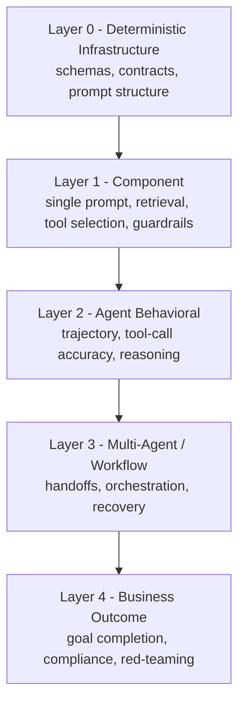

# Evals

Personal reference notes. Sources: [Claude Platform Docs - Define success criteria and build evaluations](https://platform.claude.com/docs/en/test-and-evaluate/develop-tests), [Anthropic - Writing effective tools for agents](https://www.anthropic.com/engineering/writing-tools-for-agents), [AI Assurance: A Comprehensive Testing Strategy for Enterprise AI Systems (Badagi et al., May 2026, arXiv:2605.23459)](https://arxiv.org/abs/2605.23459). The five-layer pyramid in Section 3 is one recent paper's proposed framework, not an established industry standard - flagged accordingly below. RAGAS metrics: [ragas documentation](https://github.com/explodinggradients/ragas).

## 1. Tests vs. evaluations - a distinction worth keeping precise

These get used interchangeably and shouldn't be. A **test** is a deterministic assertion - pass or fail, single input, cheap, repeatable. An **evaluation** is a probabilistic assessment - a score, run over a dataset of many inputs, requiring judgment from a human or a second model. Conflating them causes two specific failures: treating an evaluation as a test produces false confidence (a binary pass/fail on inherently variable behavior ignores the distribution); treating a test as an evaluation wastes money (spinning up an LLM judge to check something a schema assertion would catch for free).

| | Test | Evaluation |
|:---|:---|:---|
| Output | Pass / fail | Score (continuous or categorical) |
| Input | Single case | Dataset - many cases |
| Repeatability | Deterministic | Probabilistic - needs multiple runs to trust |
| Right for | Schemas, contracts, structured output | Semantic quality, reasoning, grounding, safety |

`11-hooks.md`'s deterministic exit-code checks are tests in this sense, running inline in production. Everything in this file is mostly about evaluations - though Section 3 shows exactly where tests fit inside the same framework.

## 2. Grading methods - how a score actually gets produced

Anthropic's own guidance is direct: choose the fastest, most reliable, most scalable method the judgment allows, in this order.

| Method | Speed / cost | Reliability | Use for |
|:---|:---|:---|:---|
| Code-based (exact match, string match, schema check) | Fastest, near-zero cost | Highest - deterministic | Anything structurally verifiable |
| LLM-based grading | Fast, scalable | Good once calibrated | Complex judgment that resists a fixed rule |
| Human grading | Slowest, most expensive | Highest nuance | Calibrating LLM judges; avoid at scale otherwise |

For LLM-based grading specifically: write a detailed, unambiguous rubric rather than a vague quality bar ("must mention the company name in the first sentence," not "should be professional"); make the output empirical - a 1–5 scale or a binary verdict, not open prose; and ask the judge to reason before it scores, then discard the reasoning - this measurably improves grading accuracy on judgment-heavy tasks. One rubric per dimension, never combined - a rubric checking both factual correctness and tone in one pass produces inconsistent scores that can't be traced back to which dimension actually failed.

**Success criteria**, before any of the above: specific ("accurate sentiment classification," not "good performance"), measurable (even fuzzy targets like safety can be quantified - "fewer than 0.1% of outputs flagged for toxicity across 10,000 trials" beats "safe outputs"), achievable against current frontier capability, and relevant to what the application actually needs.

## 3. The levels: a five-layer pyramid

This is the direct answer to "what levels of evals are there." A recent paper proposes five layers, organized so that **economic cost increases going up, and diagnostic specificity decreases going up** - a failure caught at the bottom is cheap and points at an exact fix; the same failure surfacing at the top is expensive to diagnose and already user-facing.

| Layer | What's evaluated | No live model call? |
|:---|:---|:---|
| 0 - Deterministic infrastructure | Schemas, API contracts, prompt structure - pure assertions | Correct, fully offline |
| 1 - Component | One prompt against its own dataset; retrieval precision/recall in isolation; tool-selection routing; guardrail effectiveness | First layer with live calls |
| 2 - Agent behavioral | A single agent's full trajectory across a multi-step task - not just the output, the path | Live, multi-step |
| 3 - Multi-agent / workflow | Handoff fidelity between agents, orchestration correctness, failure recovery | Live, cross-agent |
| 4 - Business outcome | End-to-end goal completion, policy compliance, hallucination rate, red-teaming | Live, full system |

**The diagnostic discipline that makes this a pyramid and not just a list**: check bottom-up when something breaks. A goal-completion score dropping at Layer 4 with clean Layer 3 coordination tests but elevated Layer 2 tool-call failures on date parameters points precisely at a Layer 1 prompt fix - without the layered structure, that same symptom could take days to trace instead of hours.

**Claim strength**: this exact five-layer taxonomy is one paper's proposal (May 2026), not a settled standard - treat the specific layer boundaries as one well-reasoned option. What *is* corroborated independently: several current evaluation vendors (Langfuse, Confident AI, Braintrust, LangChain), writing separately in the same period, converged on a simpler three-scope version of the same idea - **component-level, trajectory-level, and end-to-end** - which maps directly onto this pyramid's Layers 1, 2, and 4. Treat the three-scope version as the safer, more broadly-agreed baseline, and the five-layer version as a useful refinement when you need finer diagnostic resolution (splitting out Layer 0's pure-assertion layer, and Layer 3's multi-agent-specific failures).

## 4. Offline vs. online - an axis orthogonal to the layers

Every layer above can run **offline** (a fixed, replayable dataset, checked before a change ships - the natural home for CI) or **online** (sampled live production traffic, checked continuously after shipping). Offline catches regressions before a user sees them; online is the only way to catch **model drift** - quiet behavioral change in a cloud-hosted model that no one on your side triggered. Three distinct change scenarios, each needing different evaluation discipline:

| Scenario | Risk | Discipline |
|:---|:---|:---|
| Model changes, prompts unchanged | Medium - different model, same instructions, different interpretation | Re-run every prompt's evaluation, not just a smoke test |
| Prompt changes, model unchanged | Medium - even small wording changes shift behavior across the input distribution | Treat every prompt edit as a code change requiring its own eval run |
| Both change at once | Highest | Isolate variables - validate the new model against the *existing* prompts first, then introduce prompt changes separately |

## 5. Consistency - a single run tells you almost nothing

Because outputs are probabilistic, one passing run is not evidence of reliability and one failing run may be noise. Run the same input against the same target several times and classify the result: **consistent pass** (reliable, trust it), **flaky** (passes most of the time - tighten the prompt until the pass rate clears an acceptable threshold, don't ship as-is), or **consistent failure** (a real regression, investigate immediately). This is also the correct instrument for model-migration decisions: a candidate model at 95% on a single run and one at 95% consistently across ten runs are not equivalent claims.

## 6. A failure taxonomy, for designing coverage rather than guessing at it

A testing strategy without a named failure taxonomy only catches the failures someone happened to think of. Five categories, each requiring a genuinely different test mechanism:

| Category | Example | What catches it |
|:---|:---|:---|
| Grounding | Confident hallucination; response contradicts retrieved context | Semantic evaluation against source material - not output inspection alone |
| Reasoning | Right answer, wrong (fragile) reasoning path; instruction drift mid-session | Trajectory evaluation, not output-only checks |
| Safety | Prompt injection, jailbreak, policy-violating compliance | Adversarial test sets - normal inputs systematically under-detect this category |
| Coordination | Context lost across a handoff; a sub-agent over-delegating; an infinite retry loop | System-level, cross-agent evaluation - invisible to any single component's tests |
| Stochastic | A prompt passing 70% of runs and failing 30%, with no code change | Repeated-run consistency analysis (Section 5) |

## 7. RAG-specific evaluation, extending `05-rag.md`

A fluent, confident response and a correct one are not the same claim in a RAG system - retrieval and generation are two independent failure surfaces, and scoring only the final output can't tell you which one broke. Four metrics, each isolating one surface:

| Metric | Question | Failure it catches |
|:---|:---|:---|
| Context precision | Is what was retrieved actually relevant? | Noisy retrieval degrading generation even when generation itself is fine |
| Context recall | Did retrieval surface *everything* needed? | Incomplete answers that look like generation failures but originate upstream |
| Faithfulness | Is every claim in the response supported by retrieved content? | Hallucination - the primary quantitative safeguard against it |
| Answer relevancy | Does the response actually address the question, directly? | Accurate, well-grounded answers that bury the point in surrounding text |

The four scores read as a diagnostic profile, not a single number:

| Precision | Recall | Faithfulness | Diagnosis |
|:---|:---|:---|:---|
| Low | Low | any | Retrieval pipeline broken - check chunking and embeddings |
| High | Low | any | Recall gap - check index coverage |
| High | High | Low | Hallucination - generation grounding is insufficient |
| High | High | High | Retrieval is fine; a low relevancy score points at prompt/response-shaping instructions instead |

Treat faithfulness and context recall as **non-negotiable gates** - a response that scores well everywhere else but fails faithfulness should fail the whole evaluation, because hallucination and incompleteness are the highest-risk failure modes in a RAG system specifically.

## 8. How this fits the rest of the stack

Evals are not a thirteenth tier stacked on top of the abstraction hierarchy from files `01`–`12` - they're the discipline that **measures every tier that's already there**, cutting across the stack rather than sitting inside it. Concretely:

| File | What evals check there | Typical layer |
|:---|:---|:---|
| `01` Prompt engineering | The prompt's own golden dataset - normal, edge-case, adversarial inputs | Layer 1 |
| `02` Tools / `06` MCP | Tool-selection accuracy and parameter-construction correctness, evaluated as two independent dimensions | Layer 1–2 |
| `03` Skills | The evaluation-first loop already documented there - run with no skill, build scenarios from the gap, re-run after every edit | Layer 1, self-contained |
| `04` Context engineering | Whatever's assembled into context, indirectly, via the components that feed it | Layer 1 |
| `05` RAG | Section 7 above, directly | Layer 1 |
| `07` Harness / `10` Loop engineering | Trajectory evaluation - the full path, not just the outcome; `10`'s "verify work" ranking is this same reliability hierarchy (rules-based > visual > LLM-judge) applied *inline*, at runtime, rather than offline against a dataset | Layer 2 |
| `09` / `12` Sandboxing | Red-teaming and adversarial evals - Category 3 (Safety) from Section 6 | Layer 4 |
| `08` Running LLMs locally | The three change-scenarios from Section 4 - swapping your local model version *is* Scenario 1 | Cross-cutting |
| `11` Hooks | The deterministic-assertion half of Section 1's test/evaluation split, running as Layer 0 checks in production rather than in a pre-release dataset | Layer 0 |

The one distinction worth holding onto above all the others: `10-loop-engineering.md`'s "verify work" step is an eval running **inside a single agent turn**, deciding whether to loop again right now. This file's five layers are for evaluating the **system's design**, before and continuously after deployment - same underlying reliability hierarchy, applied at two different timescales.

## 9. Checklist

- [ ] Success criteria are specific, measurable, achievable, and relevant - not "good performance"
- [ ] Grading method matches the judgment: code-based wherever structurally possible, LLM-based next, human only to calibrate or where nothing else will do
- [ ] Coverage spans multiple layers - a Layer 4 pass with no Layer 1/2 coverage can't tell you *why* it passed or *where* it will next fail
- [ ] Both offline (pre-release) and online (continuous, production-sampled) evaluation are running - offline alone misses model drift entirely
- [ ] Nothing is judged on a single run - consistency across repeated runs is checked before trusting a score
- [ ] The failure taxonomy (Section 6) is used as a coverage-design input, not an afterthought - each category needs its own test mechanism
- [ ] For RAG specifically, retrieval and generation are scored as independent surfaces, not inferred from the final output alone
- [ ] Every production incident that reveals a new failure mode gets converted into a permanent evaluation-dataset entry, not just a one-off fix

---
*Part of a 14-file reference set: prompt engineering → tools → skills → context engineering → RAG → MCP → harness engineering → running LLMs locally → agent sandboxing → loop engineering → hooks → sandboxing → evals → agent orchestration.*
