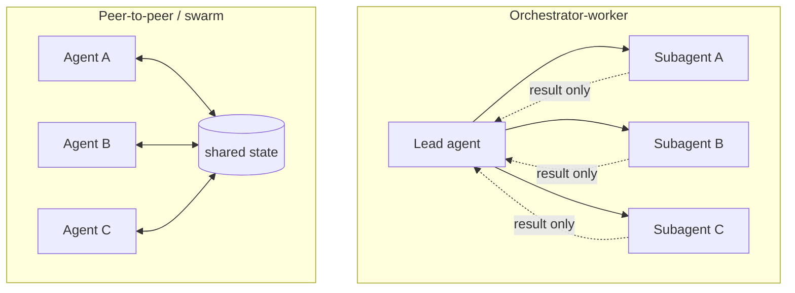

# Agent Orchestration, Decomposition, and Parallel Execution

Personal reference notes. Primary source: [Anthropic - How we built our multi-agent research system](https://www.anthropic.com/engineering/multi-agent-research-system) (June 2025). Figures (15x token cost, 90.2% improvement) are Anthropic's own internal evaluation, cited as such below.

## 1. Scope: the deep dive `07` and `10` gestured at

`07-harness-engineering.md` §5 covered two coordination patterns (planner/generator/evaluator, parallel-workers-on-shared-git) at the level of "here's an architecture that works." `10-loop-engineering.md` §8 noted that a subagent is a nested loop and moved on. Neither fully answers three questions this file is dedicated to: **how do you decompose a task well**, **what exactly should a delegated instruction contain**, and **when is parallelizing actually worth its cost**. Treat this as the same relationship `10` has to `07` - a zoom into one part of the harness, not a replacement for it.

## 2. Why multi-agent at all - and its real cost

The case for running several agents instead of one: **compression** (subagents explore independently in parallel, each condensing a large space down to the tokens that matter before reporting back), **separation of concerns** (distinct tools, prompts, and trajectories reduce path dependency - one agent's wrong turn doesn't contaminate another's), and **scaling past a single agent's limits** the same way human societies out-perform individuals through coordination, not raw individual intelligence.

None of this is free. Anthropic's own figures, from their Research system specifically: multi-agent execution costs roughly **15x the tokens** of a single chat interaction, and on their internal research evaluation, the orchestrator-worker architecture beat a single Claude Opus 4 agent by **90.2%**. Both numbers matter - the second doesn't justify itself without the first. Multi-agent systems work best on **breadth-first tasks**: many genuinely independent directions to explore, where the total information exceeds one context window. They're the wrong tool for narrow, sequential-dependency-heavy tasks, where the token multiplier buys nothing because there's nothing to parallelize.

## 3. Two topologies, and the trade-off between them

**Orchestrator-worker** constrains the topology deliberately: workers never talk to each other, and every decision about what happens next lives in the lead agent. The isolation is closer to total than partial - each subagent gets a self-contained task description, an output format, and a fresh context window, and doesn't know the other subagents exist or that it could coordinate with them mid-task. This is a design choice, not a limitation worked around: constrained topology is easier to reason about, debug, and keep predictable.

**Peer-to-peer / swarm** - the shared-git-repo pattern from `07-harness-engineering.md` §5 is a concrete instance of this - lets agents read and write common state directly, with no central planner. More flexible, genuinely harder to reason about, and the right choice when the coordination problem itself is the point (independent workers claiming tasks from a shared pool) rather than a single query being decomposed top-down.

| | Orchestrator-worker | Peer-to-peer / swarm |
|:---|:---|:---|
| Who decides what's next | The lead agent, always | Distributed, via shared state |
| Predictability | High - one place to look | Lower - emergent from many agents |
| Best fit | A single query decomposed into independent sub-questions | Many workers claiming from a shared task pool |
| Failure mode | Lead agent becomes a bottleneck | Coordination without a mutex - two agents claim the same work |

## 4. Decomposing a task well

Generic decomposition strategies, useful as a starting vocabulary regardless of whether agents are involved: **functional** (split by capability or domain - one subagent per topic area), **data-parallel** (same operation, independent partitions of the data), **pipeline** (stage A's output feeds stage B - this is `07`'s initializer/coding-agent split, applied across sessions rather than across agents), and **hierarchical** (a subtask is itself decomposed further, recursively).

Whichever strategy fits, Anthropic's specific finding is about *quality*, not *category*: **without a detailed task description, agents duplicate work, leave gaps, or go looking for the wrong information.** A well-formed delegated subtask has four parts, all four, not a subset:

1. **An objective** - what this subagent is actually trying to find or produce.
2. **An output format** - the shape the lead agent expects back, stated explicitly rather than inferred.
3. **Guidance on tools and sources** - which tools to prefer, which sources count as high-quality, for this specific subtask.
4. **Clear task boundaries** - what's explicitly out of scope, so two subagents don't both claim the same territory.

This is the delegation-specific version of `01-prompt-engineering.md`'s "brilliant new hire with no context" framing - except the new hire here has no ability to ask a clarifying question mid-task, because it won't see the lead agent again until it's done.

## 5. What a subagent should and shouldn't inherit

The isolation principle from Section 3 has a practical consequence for what actually goes into a delegated prompt: **almost nothing beyond the task itself.** Not the lead agent's full conversation history, not its reasoning about *other* subtasks, not context about subagents running in parallel. This is deliberate, not an oversight - a subagent that inherited everything the lead agent knew would spend its own context re-deriving relevance instead of working, and would be harder to isolate when something goes wrong. Pass the four elements from Section 4 and nothing else by default; add more only when a specific failure demonstrates the subagent genuinely needed it.

## 6. Result aggregation - the part decomposition guides tend to skip

Decomposing a task is half the problem; recombining the results is the other half, and it needs its own explicit strategy rather than an implicit "just concatenate it":

- **Concatenation** - valid only when subtasks are genuinely independent and don't need reconciling against each other. The cheapest option, and the one most likely to be reached for when it shouldn't be.
- **Ranked selection** - generate multiple candidate answers to the *same* question in parallel, then pick or rank the best one. Different use case from decomposition - this is redundancy for quality, not division of labor.
- **Reduce / summarization** - condense many findings into one coherent output. The default for genuine breadth-first research, where the lead agent's job is synthesis, not just collection.
- **A dedicated synthesis specialist** - Anthropic's Research system runs a separate citation-verification pass as its own specialized agent, distinct from the main synthesis step. The general lesson: a cross-cutting concern that applies to *every* subagent's output (citation accuracy, format compliance, a consistency check) is often better run once, centrally, than duplicated into every subagent's own instructions.

**Handle disagreement explicitly.** When two subagents return conflicting information, the lead agent should surface and reconcile the conflict deliberately - silently picking one subagent's answer over another's discards a signal that the task might need a fifth subagent, not a coin flip.

## 7. Two levels of parallelism, not one

Easy to conflate; Anthropic's system uses both, deliberately, at different scopes:

1. **The lead agent spins up 3–5 subagents in parallel**, rather than working through them one at a time - this is orchestration-level parallelism.
2. **Each subagent uses several tools in parallel within its own turn** - this is the same mechanism `01-prompt-engineering.md` §6 covers (parallel tool calls, steerable via an explicit instruction), just happening inside a worker rather than at the top level.

Both compound. A lead agent running 4 subagents, each of which fires 3 parallel tool calls per turn, is running a genuinely different shape of workload than a single agent making one tool call at a time - which is exactly where the 15x token cost from Section 2 comes from, and exactly why the task needs to be breadth-first enough to actually use that capacity.

## 8. Production reliability, specific to multi-agent systems

Three problems that don't show up in a single-agent harness at all:

- **Errors compound instead of staying local.** An agent running for a long period, maintaining state across many tool calls, can't simply restart from the beginning when something fails partway through - that discards real, expensive work. The mitigation is the same instinct as `07`'s initializer/coding-agent split: durable execution and regular checkpoints, so a failure resumes from recent state rather than from zero.
- **Debugging needs full tracing, not spot-checks.** With several agents' decisions interleaving, production tracing of decision patterns and interaction structure - not the content of individual conversations, which stays private - is what makes a failure diagnosable after the fact rather than only reproducible by luck.
- **Deploying a change mid-flight is its own problem.** Updating prompts or logic while agents are actively mid-task risks disrupting them outright. **Rainbow deployments** - gradually shifting traffic from the old version to the new one while both run simultaneously, rather than a hard cutover - let in-flight agents finish on the version they started with.

**One honest current limitation worth knowing**, not a solved problem: most production multi-agent systems, including Anthropic's own, run subagents **synchronously** - the lead agent waits for an entire batch of subagents to finish before proceeding. This is simpler to reason about but creates a real bottleneck. Asynchronous execution - subagents working concurrently, spawning further subagents as needed without the lead agent blocking - would unlock more parallelism, but introduces genuinely harder problems in result coordination, state consistency, and error propagation across agents that don't have easy answers yet.

## 9. Evaluating a multi-agent system, concretely

This extends `13-evals.md`'s Layer 3 (multi-agent / workflow evaluations) with a real, specific example rather than an abstract description. Multi-agent evaluation is harder than single-agent evaluation in one specific way: you often don't know the "correct" sequence of steps in advance, so you can't just check whether the agent followed a prescribed path - you need to judge the *outcome* while also assessing whether the *process* was reasonable, since a lucky bad process is a different problem than a sound one.

Anthropic's own rubric, run as a single LLM-judge call producing a 0.0–1.0 score plus a pass/fail grade - which they found more consistent and better aligned with human judgment than more elaborate grading schemes:

| Criterion | Question |
|:---|:---|
| Factual accuracy | Do the claims match the sources? |
| Citation accuracy | Do the cited sources actually support the claims? |
| Completeness | Are all the requested aspects covered? |
| Source quality | Did it prefer primary sources over weaker secondary ones? |
| Tool efficiency | Were the right tools used, a reasonable number of times? |

Two practical lessons alongside the rubric itself: **start evaluating with a handful of examples immediately** rather than waiting to build a comprehensive eval suite first - small-sample feedback early beats a thorough suite that arrives too late to shape the design. And **human evaluation still catches real gaps automation misses** - Anthropic specifically found source-quality issues this way, which then became explicit heuristics added back into the prompts.

## 10. When not to parallelize - including on your own setup

The 15x cost from Section 2 is the constant you weigh every time. Skip multi-agent decomposition when the task is narrow enough to fit one context window comfortably, when subtasks have real sequential dependencies rather than genuine independence (decomposing a dependency chain into "parallel" agents just adds coordination overhead with no speed benefit), or when a single well-scoped agent already solves it reliably.

This matters concretely for your own stack. Heavy subagent parallelism assumes cheap, fast, *concurrent* inference capacity - which is exactly what a single local card doesn't have much of. `08-running-llms-locally.md` §5 sized your `llama-server` for a handful of `--parallel` slots against a 12 GB card's real headroom; spinning up 3–5 subagents against that same local Qwen endpoint would immediately contend for the same limited slots, serializing what's supposed to be parallel and defeating the point. This pattern is a much more natural fit for your planned OpenCode + Hermes stack backed by the Claude and OpenAI APIs - cloud concurrency doesn't share your GPU's VRAM budget - than for anything routed through local inference. If a task is genuinely breadth-first and worth the token cost, that's a reason to route it to the cloud-backed agent stack specifically, not to the local model.

## 11. Checklist

- [ ] The task is genuinely breadth-first - independent sub-questions, not a disguised sequential dependency chain
- [ ] The 15x-ish token cost has been weighed against the task's actual value, not assumed to be worth it by default
- [ ] Topology chosen deliberately - orchestrator-worker for a decomposed query, peer-to-peer for a shared task pool - not defaulted to whichever is more familiar
- [ ] Every delegated subtask states an objective, output format, tool/source guidance, and explicit boundaries - all four
- [ ] Subagents inherit the minimum context needed, not the lead agent's full history
- [ ] An aggregation strategy is chosen explicitly (concatenate, rank, reduce, or a dedicated synthesis pass) rather than defaulting to concatenation
- [ ] Conflicting subagent results are surfaced and reconciled deliberately, not silently resolved by picking one
- [ ] Durable execution and checkpoints exist so a mid-task failure doesn't discard all completed work
- [ ] Evaluation judges both outcome and process, since the "correct" step sequence usually isn't known in advance
- [ ] Local-inference concurrency limits are checked before routing a heavily-parallel task through a single local model endpoint

---
*Part of a 14-file reference set: prompt engineering → tools → skills → context engineering → RAG → MCP → harness engineering → running LLMs locally → agent sandboxing → loop engineering → hooks → sandboxing → evals → agent orchestration.*
